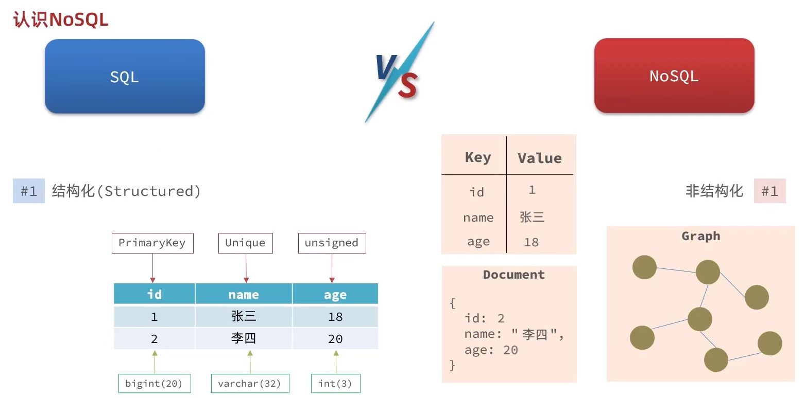
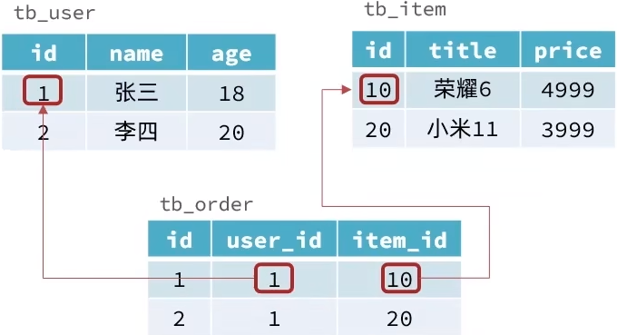
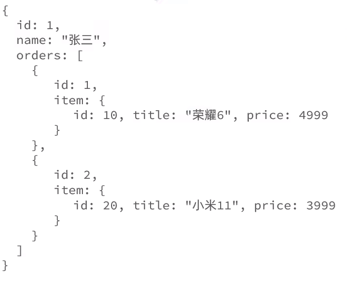
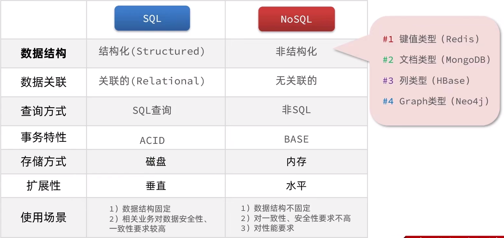
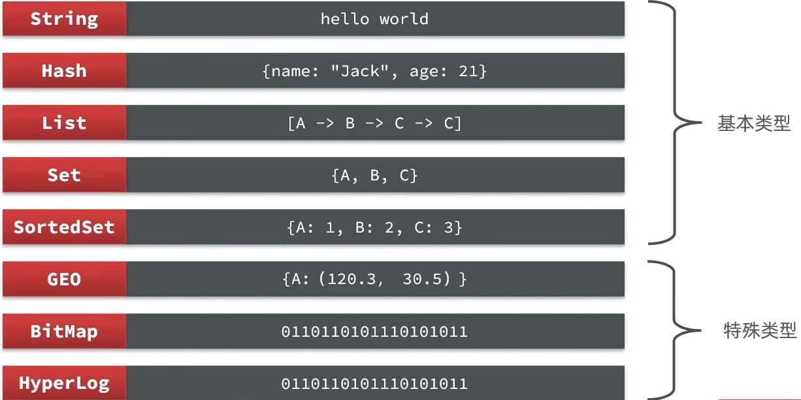

# 快速入门
redis的常见命令和客户端的使用
# 1.初识Redis
## 1.1认识NoSQL
SQL：关系型数据库
NoSQL：非关系型数据库

### 1.1.1结构化差异


### 1.1.2关联的差异
SQL:

> 优点：通过第三张表存储两表之间的关系，让两张表有关联
> 
> 缺点：不能随意的表中数据的删除，因为还有关系表存在，所以要先修改
> 关系表后才能修改另外的表

NoSQL:

使用json的形式存储


> 特点：没有关联
> 
> 缺点：会有重复，例如张三买了荣耀，李四也买了荣耀但他们都会单独
> 存一次荣耀的信息

### 1.1.3SQL查询差异
SQL:


> 查询格式固定，不同的数据库（Mysql、Oracle等）
> 可以使用相同的查询语句进行SQL查询

NoSQL:


> 优点：语法简单，方便学习
> 
> 缺点：不统一，语法不同

### 1.1.4事务差异
事务要保证ACID特性，即：原子性，一致性，隔离性等

SQL:所有的关系型数据库都是满足ACID的，NoSQL就不能全部满足



## 1.2认识Redis
Redis诞生于2009年全称是Remote Dictionary Server，
远程词典服务器，是一个基于内存的键值型NOSQL数据库。

### 1.2.1特点
- 键值（key-value）型，value支持多种不同的数据结构，功能丰富
- 单线程，每个命令具备原子性
- 低延迟，速度快（基于内存，IO多路复用，良好的编码）
- 支持数据的持久化
- 支持主从集群、分片集群
- 支持多语言客户端

## 1.3安装Redis

# 2.Redis常用命令

## 2.1Redis数据结构介绍
Redis是一个key-value的数据库，key一般是String类型，
不过value类型多样



[Redis的官方文档](https://redis.io/commands/)

## 2.2Redis的通用命令
通用指令是部分数据结构的，都可以使用的指令

### 2.2.1cli中查询所有的通用数据类型
```shell
help @generic
help [command] # 查看
```

### 2.2.2KEYS
查看符合模板的所有key
```shell
help keys # 查看文档
keys name # 查看key为name的
keys * # 查看所有key

```
> **注意：**生产环境不建议使用，因为redis只有一个线程，当数据打了，
> 就会造成阻塞
> 
### 2.2.3DEL
删除一个key
```shell
del name # 删除key为name的数据
del name,age... # 删除多个key
```

### 2.2.4EXISTS
判断一个key是否存在
```shell
exists name age # 查看name和age是否存在，返回存在个数
```

### 2.2.5EXPIRE
给一个key设置有效期，有效期到期时，key会自动删除
```shell
expire name 20 # 给key为name设置20s的有效期
```

### 2.2.6TTL
查看一个key的剩余有效期
```shell
ttl name # 查看key为name的剩余有效期
```
> - -1：永久有效
> - -2：过期
> - 非负数：剩余时间


## 2.3String类型
String类型，也就是字符串类型，是redis最简单的存储类型。
其中value也是字符串，不过根据字符串的格式不同，又可以分为3类：
- String：普通字符串
- int：整数类型，可以自增，自减操作
- float：浮点类型，可以自增，自减操作
> 不管那种格式，底层都是字节数组的形式存储，只不过编码方式不同。
> 字符类型的最大空间不能超过512m
> 


### 2.3.1String类型的常用命令
set：添加或修改一个已经存在的一个String类型的键值对
```shell
set name sgming # 添加一个name-sgming的键值对
set name sgm # 把原来name-sgming的键值对修改为name-sgm
```

get：根据key获取String类型的value
```shell
get name # 获取key为name的value
```

MSET：批量添加多个String类型的value
```shell
MSET k1 v1 k2 v2 k3 v3...
```

MGET：根据多个key获取多个String类型的value
```shell
MGET k1 k2 k3
```

INCR：让一个整型key自增1
```shell
incr age # 让age对应的value自增1
```

INCRBY：让一个整型key按指定的步长自增
```shell
incrby age 2 # 让age的value自增2
incrby age -2 # 让age的value自增-2
```

INCRBYFLOAT：让浮点类型的数字按指定的步长自增
```shell
incrbyfloat price 0.5 # 让price的key自增0.5
```

SETNX：添加一个String类型的键值对，前提是这个key不存在，否则不执行
```shell
setnx name sgming # 存在加不执行，不存在就添加
set name sgm nx # 效果和上面的一样
```

SETEX：添加一个String类型的键值对，并指定有效期
```shell
setex name 10 sgm # 给name-sgm这个键值对设置了10s的有效期
set name sgm ex 10 # 效果和上面一样
```


