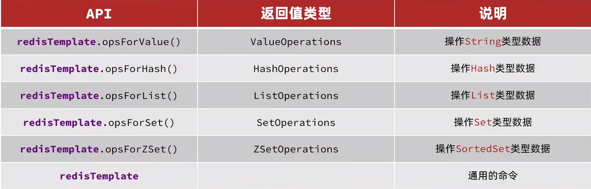
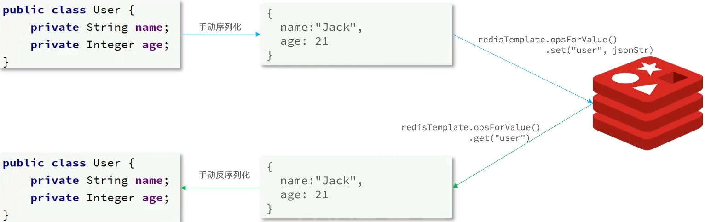
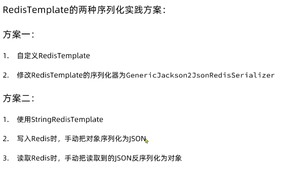

# 快速入门
redis的常见命令和客户端的使用
# 1.初识Redis
## 1.1认识NoSQL
SQL：关系型数据库
NoSQL：非关系型数据库

### 1.1.1结构化差异


### 1.1.2关联的差异
SQL:

> 优点：通过第三张表存储两表之间的关系，让两张表有关联
> 
> 缺点：不能随意的表中数据的删除，因为还有关系表存在，所以要先修改
> 关系表后才能修改另外的表

NoSQL:

使用json的形式存储


> 特点：没有关联
> 
> 缺点：会有重复，例如张三买了荣耀，李四也买了荣耀但他们都会单独
> 存一次荣耀的信息

### 1.1.3SQL查询差异
SQL:


> 查询格式固定，不同的数据库（Mysql、Oracle等）
> 可以使用相同的查询语句进行SQL查询

NoSQL:


> 优点：语法简单，方便学习
> 
> 缺点：不统一，语法不同

### 1.1.4事务差异
事务要保证ACID特性，即：原子性，一致性，隔离性等

SQL:所有的关系型数据库都是满足ACID的，NoSQL就不能全部满足


## 1.2认识Redis
Redis诞生于2009年全称是Remote Dictionary Server，
远程词典服务器，是一个基于内存的键值型NOSQL数据库。

### 1.2.1特点
- 键值（key-value）型，value支持多种不同的数据结构，功能丰富
- 单线程，每个命令具备原子性
- 低延迟，速度快（基于内存，IO多路复用，良好的编码）
- 支持数据的持久化
- 支持主从集群、分片集群
- 支持多语言客户端

## 1.3安装Redis
安装文档：https://github.com/ShenGuangMing/redis-itcast/blob/master//RedisInstall.md


# 2.Redis常用命令

## 2.1Redis数据结构介绍
Redis是一个key-value的数据库，key一般是String类型，
不过value类型多样


[Redis的官方文档](https://redis.io/commands/)

## 2.2Redis的通用命令
通用指令是部分数据结构的，都可以使用的指令

### 2.2.1cli中查询所有的通用数据类型
```shell
help @generic
help [command] # 查看
```

### 2.2.2KEYS
查看符合模板的所有key
```shell
help keys # 查看文档
keys name # 查看key为name的
keys * # 查看所有key

```
> **注意：**生产环境不建议使用，因为redis只有一个线程，当数据打了，
> 就会造成阻塞
> 
### 2.2.3DEL
删除一个key
```shell
del name # 删除key为name的数据
del name,age... # 删除多个key
```

### 2.2.4EXISTS
判断一个key是否存在
```shell
exists name age # 查看name和age是否存在，返回存在个数
```

### 2.2.5EXPIRE
给一个key设置有效期，有效期到期时，key会自动删除
```shell
expire name 20 # 给key为name设置20s的有效期
```

### 2.2.6TTL
查看一个key的剩余有效期
```shell
ttl name # 查看key为name的剩余有效期
```
> - -1：永久有效
> - -2：过期
> - 非负数：剩余时间


## 2.3String类型
String类型，也就是字符串类型，是redis最简单的存储类型。
其中value也是字符串，不过根据字符串的格式不同，又可以分为3类：
- String：普通字符串
- int：整数类型，可以自增，自减操作
- float：浮点类型，可以自增，自减操作
> 不管那种格式，底层都是字节数组的形式存储，只不过编码方式不同。
> 字符类型的最大空间不能超过512m
> 


### 2.3.1String类型的常用命令
set：添加或修改一个已经存在的一个String类型的键值对
```shell
set name sgming # 添加一个name-sgming的键值对
set name sgm # 把原来name-sgming的键值对修改为name-sgm
```

get：根据key获取String类型的value
```shell
get name # 获取key为name的value
```

MSET：批量添加多个String类型的value
```shell
MSET k1 v1 k2 v2 k3 v3...
```

MGET：根据多个key获取多个String类型的value
```shell
MGET k1 k2 k3
```

INCR：让一个整型key自增1
```shell
incr age # 让age对应的value自增1
```

INCRBY：让一个整型key按指定的步长自增
```shell
incrby age 2 # 让age的value自增2
incrby age -2 # 让age的value自增-2
```

INCRBYFLOAT：让浮点类型的数字按指定的步长自增
```shell
incrbyfloat price 0.5 # 让price的key自增0.5
```

SETNX：添加一个String类型的键值对，前提是这个key不存在，否则不执行
```shell
setnx name sgming # 存在加不执行，不存在就添加
set name sgm nx # 效果和上面的一样
```

SETEX：添加一个String类型的键值对，并指定有效期
```shell
setex name 10 sgm # 给name-sgm这个键值对设置了10s的有效期
set name sgm ex 10 # 效果和上面一样
```

## 2.4Key的层级格式
Redis的Key允许多个单词形成层级结构，多个单词用`:`分开，例如：


> 格式不一定是这样，你可以根据自己的需求来删除或添加词条


## 2.5Hash类型
Hash类型，也叫散列，其value是一个无序字典，类似java中的HashMap结构

String类型是将对象序列化为json字符串后存储的，当需要修改对象的某个字段时很不方便：


Hash结构可以将对象的每个字段独立存储，可以针对单个字段做CURD


### 2.5.1Hash的常见命令
- HSET：添加或者修改hash类型的key的field的值

```shell
# 格式：[key] [field] [value]
hset sgm:user:1 name Jack
hset sgm:user:1 age 18
```
- HGET：获取一个hash类型key的field的value值
```shell
# hget [key] [field]
hget sgm:user:1 name # 获取name
hget sgm:user:2 age # 获取age
```

- HMSET :添加多个
```shell
# 格式：[key] [field1] [value1] [field2] [value2]...
HMSET smg:user:2 name Lucy age 20
```

- HMGET：获取多个field的value
```shell
# 格式：[key] [field1] [field2]...
HMGET smg:user:2 name age 
```

- HGETALL：获取key所有的field和value
```shell
# 格式： HGETALL [key]

HGETALL smg:user:2 
```

- HKEYS：获取hash类型key的所有field
```shell
# 格式：HKEYS [key]

HKEYS smg:user:2
```

- HVALS：获取hash类型key中所有的value
```shell
# 格式：HKEYS [key]
HVALS smg:user:2
```

- HINCRBY：让一个Hash类型的key指定字段自增指定步长
```shell
# 格式：HINCRBY [key] [field] [步长]
HINCRBY sgm:user:1 age 2 # 步长为2
HINCRBY sgm:user:1 age -2 # 步长为-2
```

- HSETNX：添加一个hash类型的key的field值，前提是这个field不存在，否则不执行
```shell
# 格式：HSETNX [key] [field] [value]
HSETNX smg:user:2 age 99 # 不存在就添加，存在就不执行
```

## 2.6List类型
Redis中的List类型与Java中的LinkedList类似，可以看做是一个双向链表结构。既可以支持正向检索和也可以支持反向检索。
### 2.6.1特点
- 有序
- 元素可以重复
- 插入和删除快
- 查询速度一般

### 2.6.1List常用命令
- LPUSH/RPUSH：向列表左/右侧插入一个或多个元素
```shell
# 格式：LPUSH/RPUSH [key] [element...]
LPUSH/RPUSH users jake tom lucy sgm zzy
```

- LPOP/RPOP：移除并返回左/右边的一个或多个元素，没有就返回nil
```shell
# 格式：LPOP/RPOP [key] [count]
LPOP/RPOP users 2 # 返回：zzy和sgm
```

- LRANGE：返回一段角标范围内的所有元素
```shell
# 格式：LRANGE [key] [start] [end]
LRANGE users 0 1 # 返回：jack top
```
> 下标从0开始

- BLPOP/BROPO：与LPOP和RPOP类似，只不过在没有元素时等待指定时间，而不是直接返回nil
```shell
# 格式：BLPOP/BRPOP [key] [timeout]
BLPOP users 100 # 从左/右获取第一个元素，没有就等待100秒
```

## 2.7Set类型
Redis的Set结构与Java中的HashSet类似，可以看做是一个value为null的HashMap。因为也是一个hash表，因此具备与HashSet类似的特征:

### 2.7.1特点
- 无序
- 元素不重复
- 查找快
- 支持交集、并集、差集功能

### 2.7.2Set常用命令
- SADD：向set中添加一个或多个元素
```shell
# 格式：SADD [key] member...
SADD s1 a b c d
```

- SREM：移除set中指定的元素
```shell
# 格式：SREM [key] member...
SREM s1 a b# 删除s1中的a和b
```

- SCARD：返回set中元素的个数
```shell
# 格式：SCARD [key]
SCARD s1
```

- SISMEMBER：判断一个元素是否在set中
```shell
# 格式：SISMEMBER [key] member
SISMEMBER s1 a # 判断s1中a是否存在
```

- SMEMBERS：获取set中所有的元素
```shell
# 格式：SMEMBERS [key] 
SMEMBERS s1
```

- SINTER：求两个key的交集
```shell
# 格式：SINTER [key1] [key2]
SINTER s1 s2 # 求s1和s2的交集
```
- SDIFF：求两个key的差集
```shell
# 格式：SDIFF [key1] [key2]
SDIFF s1 s2 # 相对于s1，s2中没有的
SDIFF s2 s1 # 相对于s2，s1中没有的
```

- SUNION：求两个key的并集
```shell
# 格式：SUNION [key1] [key2]
SUNION s1 s2 
```

## 2.8SoredSet
Redis的SortedSet是一个可排序的set集合，与Java中的TreeSet有些类似，但底层数据结构却差别很大。SortedSet中的每一个元素都带有一个score属性，可以基于score属性对元素排序，底层的实现是一个跳表（SkipList)加 hash表。
### 2.8.1特点
- 可排序
- 元素不重复
- 查询速度快

### 2.8.2SoredSet常用命令
- ZADD：添加一个或多个元素到sorted set，如果已经存在就更新它的score值
```shell
# 格式：ZADD [key] [score1] [member1] [score2] [member2]...
ZADD s1 1 a 2 b 3 c
```

- ZREM:删除sorted set中指定的元素
```shell
# ZREM [key] [member]
ZREM s1 e
```

- ZSCORE：获取sorted set中指定元素的score
```shell
# ZSCORE [key] [member]
ZSCORE s1 a
```

- ZRANK: 获取sorted set指定元素的排名
```shell
# ZRANK [key] [member]
ZRANK s1 b # 返回 1
```
> 从0开始

- ZCARD: 获取元素个数
```shell
# ZCARD [key] 
ZCARD s1
```

- ZCOUNT: 统计score在给定范围的元素个数
```shell
# ZCOUNT [key] [min] [max]
ZCOUNT s1 2 4
```

- ZINCRBY: 让元素自增指定的步长
```shell
# ZINCRBY [key] [step] [member] 
ZINCRBY s1 2 e # 返回11，e原来的score为9
```

- ZRANGE: 按照score排序后，获取指定范围内的元素
```shell
# ZRANGE [key] [start] [end]
ZRANGE s1 1 2 #返回 b c`
```
> start从0开始，且是闭区间

- ZRANGEBYSCORE: 按照score排序后，获取指定score范围内的元素
```shell
# ZRANGEBYSCORE [key] [min] [max]
ZRANGEBYSCORE s1 2 4 #返回 b，b的score为3
```


- ZDIFF/ZINTER/ZUNION：差集、交集、并集
```shell
# ZDIFF/ZINTER/ZUNION [key1] [key2]
```

> 上面所有的排序默认是升序，如果降序，需要在Z后面添加REV，如：
> ZREVRANGE:先按照降序排序，在返回start到end下标的元素
> 
> 且上面区间都是闭区间

### 2.8.3SortedSet练习

- ZREM stus Tom
- ZSCORE stus Amy
- ZRANK stus Rose/ZREVRANK stus Rose 升序/降序查看排名
- ZCOUNT stus 0 80
- ZINCRBY stus 2 Amy
- ZREVRANGE stus 0 2
- ZRANGEBYSCORE stus 0 80

# 3.Redis的Java客户端

## 3.1Jedis
官方网址：https://github.com/redis/jedis
## 3.1.1环境搭建
引入依赖
```xml
<dependencies>
    <dependency>
        <groupId>redis.clients</groupId>
        <artifactId>jedis</artifactId>
        <version>3.7.1</version>
    </dependency>
</dependencies>
```
创建工具类
```java
public class JedisUtil {
    private static final Jedis jedis;
    static {
        //创建Jedis对象给定ip和端口
        jedis = new Jedis("192.168.88.129", 6379);
        //设置密码
        jedis.auth("root");
        //选择库
        jedis.select(0);
    }
    //获取
    public static Jedis getJedis() {
        return jedis;
    }

    //关闭
    public static void closeJedis() {
        if (jedis!= null) {
            jedis.close();
        }
    }
}
```
测试类
```java
public class TestTemplate {
    private Jedis jedis;
    @Before
    public void setUp() {
        jedis = new Jedis("192.168.88.129", 6379);
        jedis.auth("root");
        jedis.select(0);
    }
    //测试方法
    @After
    public void tearDown() {
        if (jedis != null) {
            jedis.close();
        }
    }
}
```
### 3.1.2测试
由于指令名和Jedis的方法名相同，这里就不做演示了

### 3.1.3Jedis连接池
factory：
```java
public class JedisConnectionFactory {
    private static final JedisPool jedisPool;
    static {
        JedisPoolConfig jedisPoolConfig = new JedisPoolConfig();
        //最大连接
        jedisPoolConfig.setMaxTotal(8);
        //最大空闲连接
        jedisPoolConfig.setMaxIdle(8);
        //最小空闲连接
        jedisPoolConfig.setMinIdle(0);
        //设置最长等待时间
        jedisPoolConfig.setMaxWaitMillis(300);
        jedisPool = new JedisPool(jedisPoolConfig, "192.168.88.129", 6379, 1000, "root");
    }
    //获取Jedis对象
    public static Jedis getJedis() {
        return jedisPool.getResource();
    }

    //获取第几号库的jedis
    public static Jedis getJedis(int index) {
        Jedis jedis = jedisPool.getResource();
        jedis.select(index);
        return jedis;
    }
}
```

## 3.2SpringDataRedis
SpringData是Spring中数据操作的模块，包含对各种数据库的集成，其中对Redis的集成模块就叫做SpringDataRedis

官方网站：https://spring.io/projects/spring-data-redis
### 3.2.1特点
- 提供了对不同redis客户端的整合（Lettuce和Jedis）
- 提供了RedisTemplate统一的API来操作Redis
- 支持Redis发布订阅模块
- 支持Redis哨兵和集群
- 支持基于Lettuce的响应式编程
- 支持JDK，JSON，字符串，Spring对象的数据序列化及其反序列化
- 支持基于Redis的JDKCollection


### 3.2.2设计
SpringDataRedis中提供了RedisTemplate工具类，其中封装了Redis的操作。并且将不同数据类的操作API封装到不同类型中


### 3.2.3环境
父pom：
```xml
<?xml version="1.0" encoding="UTF-8"?>
<project xmlns="http://maven.apache.org/POM/4.0.0"
         xmlns:xsi="http://www.w3.org/2001/XMLSchema-instance"
         xsi:schemaLocation="http://maven.apache.org/POM/4.0.0 http://maven.apache.org/xsd/maven-4.0.0.xsd">
    <modelVersion>4.0.0</modelVersion>

    <groupId>org.example</groupId>
    <artifactId>itcast</artifactId>
    <packaging>pom</packaging>
    <version>1.0-SNAPSHOT</version>
    <modules>
        <module>pro1-basis</module>
    </modules>
    <parent>
        <artifactId>spring-boot-starter-parent</artifactId>
        <groupId>org.springframework.boot</groupId>
        <version>2.5.7</version>
    </parent>
    <properties>
        <maven.compiler.source>8</maven.compiler.source>
        <maven.compiler.target>8</maven.compiler.target>
        <project.build.sourceEncoding>UTF-8</project.build.sourceEncoding>
    </properties>
    <dependencies>
        <dependency>
            <groupId>org.projectlombok</groupId>
            <artifactId>lombok</artifactId>
        </dependency>
    </dependencies>

</project>
```
子pom：
```xml
<?xml version="1.0" encoding="UTF-8"?>
<project xmlns="http://maven.apache.org/POM/4.0.0"
         xmlns:xsi="http://www.w3.org/2001/XMLSchema-instance"
         xsi:schemaLocation="http://maven.apache.org/POM/4.0.0 http://maven.apache.org/xsd/maven-4.0.0.xsd">
    <parent>
        <artifactId>itcast</artifactId>
        <groupId>org.example</groupId>
        <version>1.0-SNAPSHOT</version>
    </parent>
    <modelVersion>4.0.0</modelVersion>

    <artifactId>pro1-basis</artifactId>

    <properties>
        <maven.compiler.source>8</maven.compiler.source>
        <maven.compiler.target>8</maven.compiler.target>
        <project.build.sourceEncoding>UTF-8</project.build.sourceEncoding>
    </properties>
    <dependencies>
        <dependency>
            <groupId>org.springframework.boot</groupId>
            <artifactId>spring-boot-starter-data-redis</artifactId>
        </dependency>
        <dependency>
            <groupId>com.fasterxml.jackson.core</groupId>
            <artifactId>jackson-databind</artifactId>
        </dependency>
        <dependency>
            <groupId>org.apache.commons</groupId>
            <artifactId>commons-pool2</artifactId>
        </dependency>

        <dependency>
            <groupId>redis.clients</groupId>
            <artifactId>jedis</artifactId>
            <version>3.7.1</version>
        </dependency>

        <dependency>
            <groupId>junit</groupId>
            <artifactId>junit</artifactId>
            <version>4.12</version>
            <scope>test</scope>
        </dependency>
    </dependencies>
</project>
```
yaml：
```yaml
spring:
  redis:
    host: 192.168.88.129
    port: 6379
    password: root
    lettuce:
      pool:
        max-active: 8
        max-idle: 8
        min-idle: 0
        max-wait: 200
```
编写一个测试
```java
@SpringBootTest(classes = Application.class)
public class Test1 {
    @Autowired
    private RedisTemplate redisTemplate;
    @Test
    public void testString() {
        redisTemplate.opsForValue().set("name", "SGMing");
        System.out.println(redisTemplate.opsForValue().get("name"));
    }
}
```
> 虽然我们能成功存了name-SGMing这个键值对，但是我们去rediscli中获取name-SGMing这个键值对时没有的（注意删除原来reids中缓存）


### 3.2.4RedisTemlate
#### 3.2.4.14RedisTemlate的序列化器
在使用RedisTemlate如果没有指明key和value的泛型，那么RedisTemlate默认会按Object类型处理，在储存和获取key和value，都会对key和value进行序列化
```text
    public void afterPropertiesSet() {
        super.afterPropertiesSet();
        boolean defaultUsed = false;
        if (this.defaultSerializer == null) {
            this.defaultSerializer = new JdkSerializationRedisSerializer(this.classLoader != null ? this.classLoader : this.getClass().getClassLoader());
        }

        if (this.enableDefaultSerializer) {
            if (this.keySerializer == null) {
                this.keySerializer = this.defaultSerializer;
                defaultUsed = true;
            }

            if (this.valueSerializer == null) {
                this.valueSerializer = this.defaultSerializer;
                defaultUsed = true;
            }

            if (this.hashKeySerializer == null) {
                this.hashKeySerializer = this.defaultSerializer;
                defaultUsed = true;
            }

            if (this.hashValueSerializer == null) {
                this.hashValueSerializer = this.defaultSerializer;
                defaultUsed = true;
            }
        }

        if (this.enableDefaultSerializer && defaultUsed) {
            Assert.notNull(this.defaultSerializer, "default serializer null and not all serializers initialized");
        }

        if (this.scriptExecutor == null) {
            this.scriptExecutor = new DefaultScriptExecutor(this);
        }

        this.initialized = true;
    }
```
> RedisTemlate源码中，我们可以看到，当我们没有指定对应的序列化时，
> 会默认指定 JdkSerializationRedisSerializer序列化器，
> 它通过ObjectOutpubStream流来写对象，将java对象转化成字节，再写入redis
> 
> **缺点：**可读性差，内存占用大

#### 3.2.4.2修改RedisTemlate序列化器的实现
配置启动类类，将RedisTemlate注入
```java
@SpringBootApplication
public class Application {
    public static void main(String[] args) {
        SpringApplication.run(Application.class, args);
    }
    @Bean
    public RedisTemplate<String, Object> redisTemplate(RedisConnectionFactory redisConnectionFactory) {
        //创建RedisTemplate
        RedisTemplate<String, Object> redisTemplate = new RedisTemplate<>();

        //设置RedisTemplate的连接工厂RedisConnectionFactory
        redisTemplate.setConnectionFactory(redisConnectionFactory);

        //设置序列化工具
        GenericJackson2JsonRedisSerializer jsonRedisSerializer = new GenericJackson2JsonRedisSerializer();

        //key和HashKey采用String序列化
        redisTemplate.setKeySerializer(RedisSerializer.string());
        redisTemplate.setHashKeySerializer(RedisSerializer.string());

        //value和HashValue采用json序列化
        redisTemplate.setValueSerializer(jsonRedisSerializer);
        redisTemplate.setHashValueSerializer(jsonRedisSerializer);
        return redisTemplate;
    }
}
```
> 之后我们就可以愉快的使用RedisTemplate了
修改测试类中的RedisTemplate
```java
@SpringBootTest(classes = Application.class)
public class Test1 {
    @Autowired
    private RedisTemplate<String, Object> redisTemplate;
    @Test
    public void testString() {
        redisTemplate.opsForValue().set("name", "SGMing");
        System.out.println(redisTemplate.opsForValue().get("name"));
    }
}
```
#### 3.2.4.3测试
对象作为value

创建User对象
```java
@Data
@AllArgsConstructor
@NoArgsConstructor
public class User {
    private Long id;
    private String name;
    private Integer age;
}
```
测试方法
```java
@SpringBootTest(classes = Application.class)
public class Test1 {
    @Autowired
    private RedisTemplate<String, Object> redisTemplate;
    @Test
    public void test1() {
        User user = new User(1L, "SGMing", 22);
        redisTemplate.opsForValue().set("user:" + user.getId(), user);
        System.out.println(redisTemplate.opsForValue().get("user:" + user.getId()));
    }
}
```
这种存储对象的方式的问题：太消耗空间，对多存一个@calss

为了节省内存空间，我们并不会使用JSON序列化器来处理value，而是统一使用String序列化器，要求只能存储String类型的key和value。当需要存储Java对象时，手动完成对象的序列化和反序列化。



### 3.2.5SpringRedisTemplate
Spring默认提供了一个StringRedisTemplate类，它的key和value的序列化方式默认就是String方式。省去了我们自定义RedisTemplate的过程:

#### 3.2.5.1在启动类注入ObjectMapper作为序列化工具
```java
@SpringBootApplication
public class Application {
    public static void main(String[] args) {
        SpringApplication.run(Application.class, args);
    }

    @Bean
    public ObjectMapper objectMapper() {
        return new ObjectMapper();
    }
}
```

#### 3.2.5.2测试类
```java
@SpringBootTest(classes = Application.class)
public class Test2 {
    @Autowired
    private StringRedisTemplate redisTemplate;
    @Autowired
    private ObjectMapper mapper;

    @Test
    public void test2() {
        redisTemplate.opsForHash().put("user:2", "name", "SGMing");
        redisTemplate.opsForHash().put("user:2", "age", "30");

        //获取
        Map<Object, Object> entries = redisTemplate.opsForHash().entries("user:2");
        for (Object o : entries.keySet()) {
            System.out.println(o + ":" + entries.get(o));
        }
    }

    @Test
    public void test1() throws JsonProcessingException {
        //创建对象
        User user = new User(1L,"谌光明", 22);
        //手动序列化
        String json = mapper.writeValueAsString(user);
        //写入数据
        String key = "user:"+user.getId();
        redisTemplate.opsForValue().set(key, json);
        //获取数据
        String result = redisTemplate.opsForValue().get(key);
        //反序列化
        User user1 = mapper.readValue(result, User.class);
        System.out.println(user1);
    }

}
```
### 总结


