# 黑马点评项目

# 1.项目启动

## 1.1数据导入

### 1.1.1在自己的MySQL中创建hmdp数据库

```mysql
create database hmdp;
```

### 1.1.2执行sql文件

使用mysql的图形化客户端将resource/db/hmdp.sql执行

## 1.2后端项目启动

### 1.2.1启动引导类

### 1.2.2测试项目是否成功

访问 http://localhost:8081/shop-type/list 是否有数据显示

## 1.3前端启动

在nginx-1.18.0文件夹使用cmd或IDEA的Terminal打开执行指令：

```shell
start .\nginx.exe # 开启nginx服务
.\nginx.exe -s stop # 停止nginx服务
```

然后访问 http://localhost:8080即可

# 2.登录

## 2.1基于Session实现登录

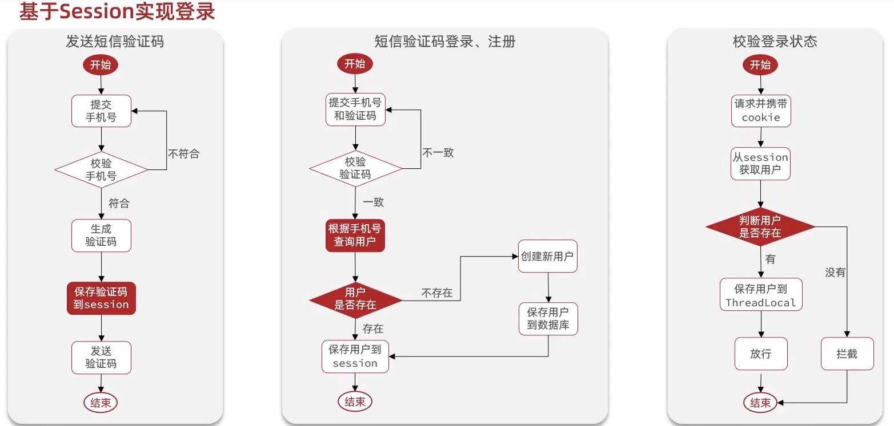

> 缺点：session不能共享，在做服务器集群的时候，让多台服务器之间共享session不好
> 且session是基于cookie实现的，浏览器如果禁用cookie，session也不能使用了，将状态保存在服务器端,占用服务器内存,如果用户量过大,会严重影响服务器的性能，且过期时间不是很灵活

## 2.2redis实现短信登录功能

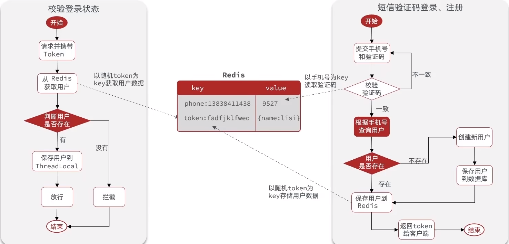

### 2.2.1短信密码登录注册

```java

@Service
@Slf4j
public class UserServiceImpl extends ServiceImpl<UserMapper, User> implements IUserService {
    @Autowired
    private StringRedisTemplate redisTemplate;

    @Override
    public R<Object> sendCode(String phone, HttpSession session) {
        //校验手机号码
        if (RegexUtils.isPhoneInvalid(phone)) {
            //手机号有误返回
            return R.error("手机号格式有误！");
        }
        //生成验证码
        String code = RandomUtil.randomNumbers(6);
        //保存到redis中，code两分钟过期，RedisConstants类是记录常量类
        redisTemplate.opsForValue().set(RedisConstants.LOGIN_CODE_KEY + phone, code,
                RedisConstants.LOGIN_CODE_TTL, TimeUnit.MINUTES);
        //发送验证码
        log.info("验证码 = {}", code);
        return R.ok();
    }

    @Override
    public R<Object> login(LoginFormDTO loginForm, HttpSession session) {
        String phone = loginForm.getPhone();
        //验证手机号
        if (RegexUtils.isPhoneInvalid(phone)) {
            //手机号有误返回
            return R.error("手机号格式有误！");
        }
        //生成token，密码登录和电话号登录都使用同一个token
        String token = UUID.randomUUID().toString(true);
        //通过不同登录方式进行验证
        if (loginForm.getCode() != null) {//验证码登录
            return loginByCode(loginForm, session, token);
        } else if (loginForm.getPassword() != null) {//密码登录
            return loginByPassword(loginForm, session, token);
        }
        return R.error("输入的验证码或密码有误");
    }

    private R<Object> loginByPassword(LoginFormDTO loginForm, HttpSession session, String token) {
        //查询手机号是否注册
        LambdaQueryWrapper<User> queryWrapper = new LambdaQueryWrapper<>();
        queryWrapper.eq(User::getPhone, loginForm.getPhone());
        User user = this.getOne(queryWrapper);
        if (user == null) {
            log.info("手机号未注册请先注册！");
            return R.error("手机号未注册请先注册！");
        }
        //处理用户密码为空情况
        if (user.getPassword() == null || user.getPassword().length() == 0) {
            log.info("用户密码未设置，请使用短信验证吗登录！");
            return R.error("密码未设置，请使用短信登录！");
        }
        //判断密码是否正确
        if (!user.getPassword().equals(loginForm.getPassword())) {
            return R.error("密码错误！");
        }
        //将用户缓存到redis中
        cacheToRedis(token, user);
        return R.ok();
    }

    private R<Object> loginByCode(LoginFormDTO loginForm, HttpSession session, String token) {
        String phone = loginForm.getPhone();
        //从redis中获取验证码
        String cache = redisTemplate.opsForValue().get(RedisConstants.LOGIN_CODE_KEY + phone);
        log.info("通过验证码登录-Cache: " + cache);
        //缓存验证码不存在了，或验证码有误
        if (cache == null || !cache.equals(loginForm.getCode())) {
            return R.error("验证码有误！");
        }
        //查询该手机号是否注册
        LambdaQueryWrapper<User> queryWrapper = new LambdaQueryWrapper<>();
        queryWrapper.eq(User::getPhone, phone);
        User user = this.getOne(queryWrapper);
        if (user == null) {//用户不存在进行注册
            user = createUserWithPhone(phone);
        }
        //缓存到redis
        cacheToRedis(token, user);
        //返回token
        return R.ok(token);
    }

    private void cacheToRedis(String token, User user) {
        //将User对象转为Hash存储，如果使用json存储就不会有下面转map问题
        UserDto userDto = BeanUtil.copyProperties(user, UserDto.class);
        //对象转Long，解决Long转换问题
        /*
        这里可以自己实现：new一个User，从map中一个个获取通过key去给对象属性值填充
         */
        Map<String, Object> userMap = BeanUtil.beanToMap(userDto, new HashMap<>(),
                CopyOptions.create()
                        .setIgnoreCase(true)
                        .setFieldValueEditor((fieldName, fieldValue) -> fieldValue.toString()));
        //给token添加前缀
        String tokenKey = RedisConstants.LOGIN_USER_KEY + token;
        //存入redis中
        redisTemplate.opsForHash().putAll(tokenKey, userMap);
        //设置token有效期
        redisTemplate.expire(tokenKey, RedisConstants.CACHE_SHOP_TTL, TimeUnit.MINUTES);
    }

    private User createUserWithPhone(String phone) {
        //创建User
        User user = new User();
        //设置用户电话号
        user.setPhone(phone);
        //初始化用户nickName
        user.setNickName(SystemConstants.USER_NICK_NAME_PREFIX + RandomUtil.randomString(10));
        //保存用户
        save(user);
        return user;
    }
}
```

### 2.2.2拦截器

redis刷新拦截器

```java

@NoArgsConstructor
@AllArgsConstructor
@Slf4j
public class RefreshTokenInterceptor implements HandlerInterceptor {
    private StringRedisTemplate redisTemplate;

    @Override
    public boolean preHandle(HttpServletRequest request, HttpServletResponse response, Object handler) throws Exception {
        //获取token
        String token = request.getHeader("authorization");
        //token不存在直接放行
        if (token == null) {
            return true;
        }
        String tokenKey = RedisConstants.LOGIN_USER_KEY + token;

        log.info("token刷新拦截器-tokenKey: {}", tokenKey);
        Map<Object, Object> user = redisTemplate.opsForHash().entries(tokenKey);
        //map转对象
        UserDto userDto = BeanUtil.copyProperties(user, UserDto.class);
        //对象存在就记录到ThreadLocal中
        if (userDto != null) {
            //刷新token
            redisTemplate.expire(tokenKey, RedisConstants.CACHE_SHOP_TTL, TimeUnit.MINUTES);
            UserDtoHolder.saveUser(userDto);
        }
        log.info("token刷新拦截器-userDto: {}", UserDtoHolder.getUser());
        //不做连接放行所有的请求
        return true;
    }

    @Override
    public void afterCompletion(HttpServletRequest request, HttpServletResponse response, Object handler, Exception ex) throws Exception {
        HandlerInterceptor.super.afterCompletion(request, response, handler, ex);
    }
}
```

登录拦截器

```java

@Slf4j
@AllArgsConstructor
@NoArgsConstructor
public class LoginInterceptor implements HandlerInterceptor {
    private StringRedisTemplate redisTemplate;

    @Override
    public boolean preHandle(HttpServletRequest request, HttpServletResponse response, Object handler) throws Exception {
        if (request.getHeader("authorization") == null) {
            return true;
        }
        //在ThreadLocal中获取UserDto
        UserDto user = UserDtoHolder.getUser();
        log.info("登录拦截器-userDto: {}", user);
        if (user == null) {
            //把请求拦截了，并返回
            response.setStatus(401);
            return false;
        }
        return true;
    }

    @Override
    public void afterCompletion(HttpServletRequest request, HttpServletResponse response, Object handler, Exception ex) throws Exception {
        UserHolder.removeUser();
    }
}
```

拦截器配置类

```java

@Configuration
public class MvcConfig implements WebMvcConfigurer {
    @Autowired
    private StringRedisTemplate redisTemplate;

    @Override
    public void addInterceptors(InterceptorRegistry registry) {
        registry.addInterceptor(new RefreshTokenInterceptor(redisTemplate)).order(0);
        registry.addInterceptor(new LoginInterceptor(redisTemplate))
                .excludePathPatterns(
                        "/user/code",
                        "/user/login",
                        "/blog/hot",
                        "/shop-type/**",
                        "/upload/**",
                        "/voucher/**",
                        "/shop/**"
                ).order(1);
    }
}
```

# 3.商户查询缓存

## 3.1什么是缓存

缓存就是数据交换的缓冲区（称作Cache)，是存贮数据的临时地方，一般读写性能较高。


## 3.2添加缓存

### 3.2.1缓存作用模型

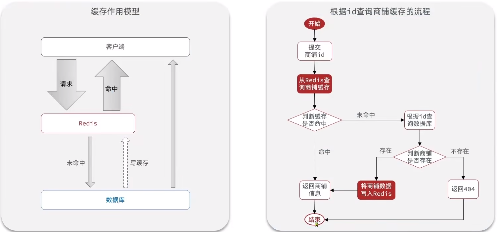

#### 3.2.2.1基于缓存模型实现

```java

@Service
@Slf4j
public class ShopServiceImpl extends ServiceImpl<ShopMapper, Shop> implements IShopService {
    @Autowired
    private StringRedisTemplate redisTemplate;

    @Override
    public R<Shop> queryShopById(Long id) {
        String shopKey = RedisConstants.CACHE_SHOP_KEY + id;
        //从redis中查询缓存
        String shopJson = redisTemplate.opsForValue().get(shopKey);
        if (StrUtil.isNotBlank(shopJson)) {//查询不为空就直接返回
            log.info("redis缓存命中");
            //命中重新刷新有效期
            redisTemplate.expire(shopKey, RedisConstants.CACHE_SHOP_TTL, TimeUnit.MINUTES);
            Shop shop = JSONUtil.toBean(shopJson, Shop.class);
            return R.ok(shop);
        }
        //查询数据库
        Shop shop = getById(id);
        if (shop == null) {//不存在就返回错误
            log.info("数据库未查询到");
            return R.error("商家不存在");
        }
        //将对象转为json
        shopJson = JSONUtil.toJsonStr(shop);
        //存入redis,10分钟失效
        redisTemplate.opsForValue().set(shopKey, shopJson, RedisConstants.CACHE_SHOP_TTL, TimeUnit.MINUTES);
        return R.ok(shop);
    }
}
```

## 3.3缓存更新策略

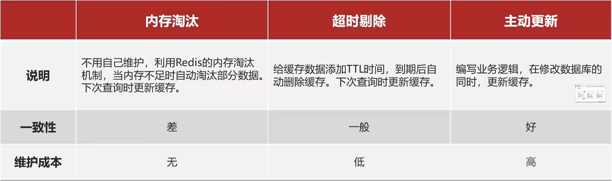

业务场景：

- 低一致行：使用内存淘汰机制或超时剔除机制，例如我们店铺类型
- 高一致性：主动更新+超时剔除兜底。如店铺详细的缓存

### 3.3.1主动更新策略

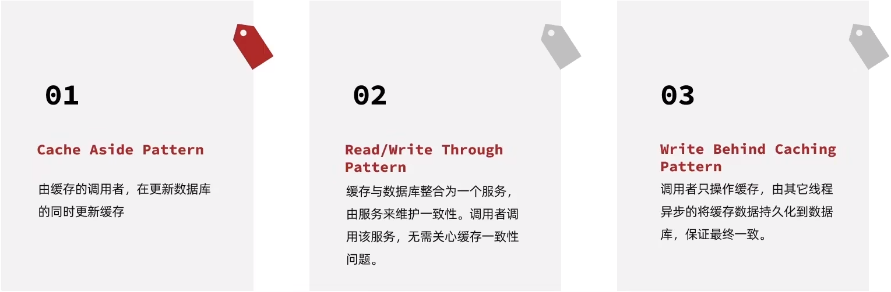

使用第一种操作缓存和数据库的三个问题：

- 删除缓存还是更新缓存
    - 更新缓存：每次更新数据库都是更新缓存，无效写操作较多
    - 删除缓存：更新数据库时让缓存失效，查询时再更新缓存
- 如何保证缓存与数据库的操作同时成功或失败
    - 单体系统，将缓存和数据库操作放在一个事务
    - 分布式系统，利用TCC等分布式事务方案
- 先操作缓存还是数据库
    - 先删除缓存，再操作数据库
    - 先操作数据库，再删除缓存

#### 3.3.1.1先删除缓存，再操作数据库

正常情况：

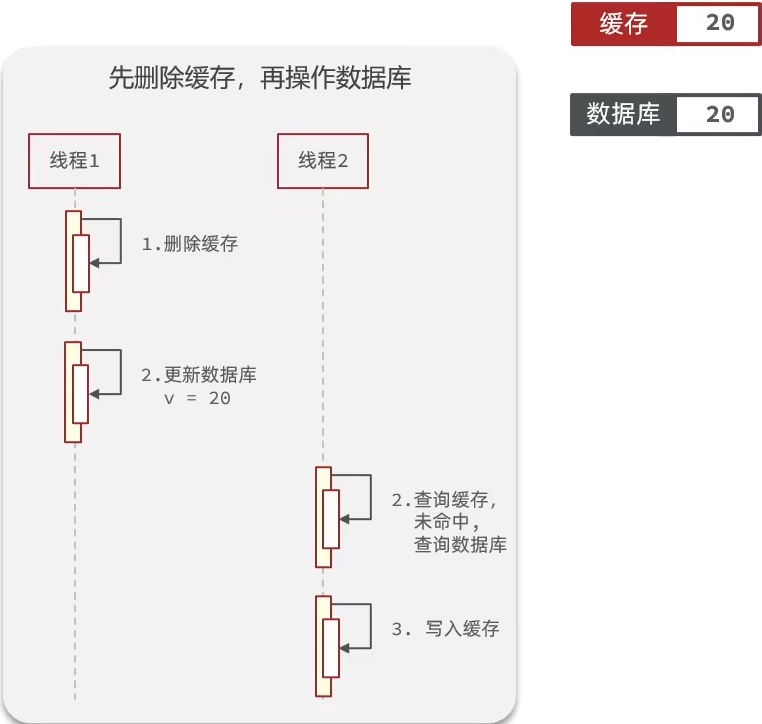

异常情况：

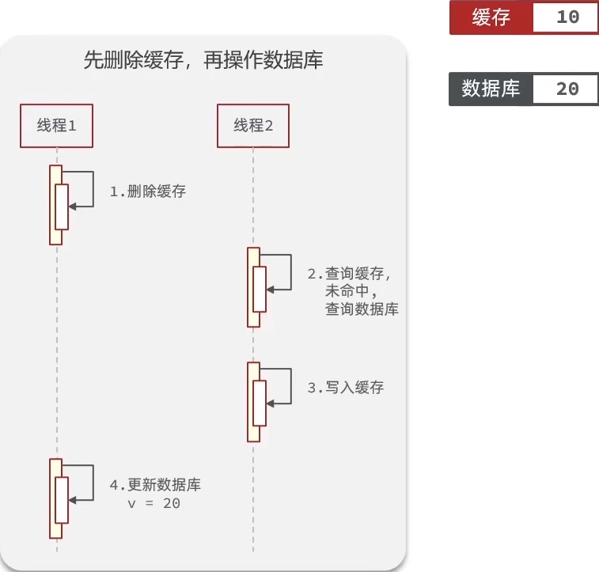

#### 3.3.1.2

正常情况：

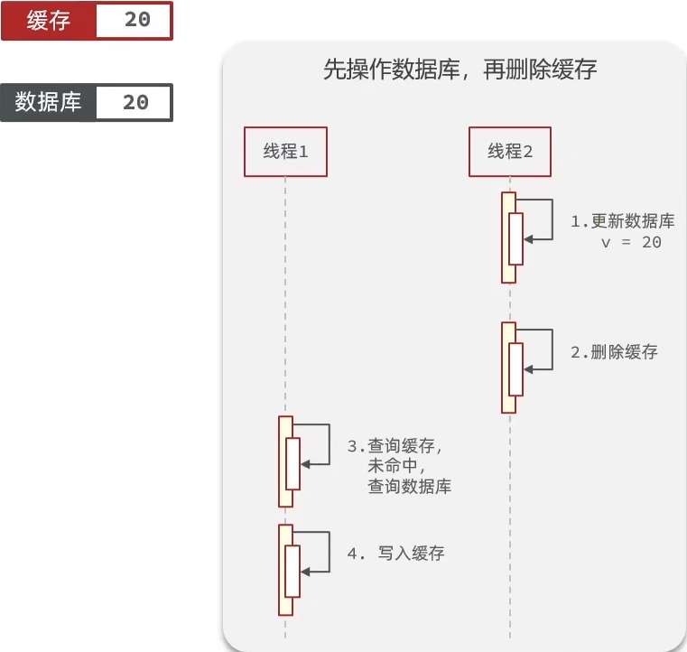

异常情况：

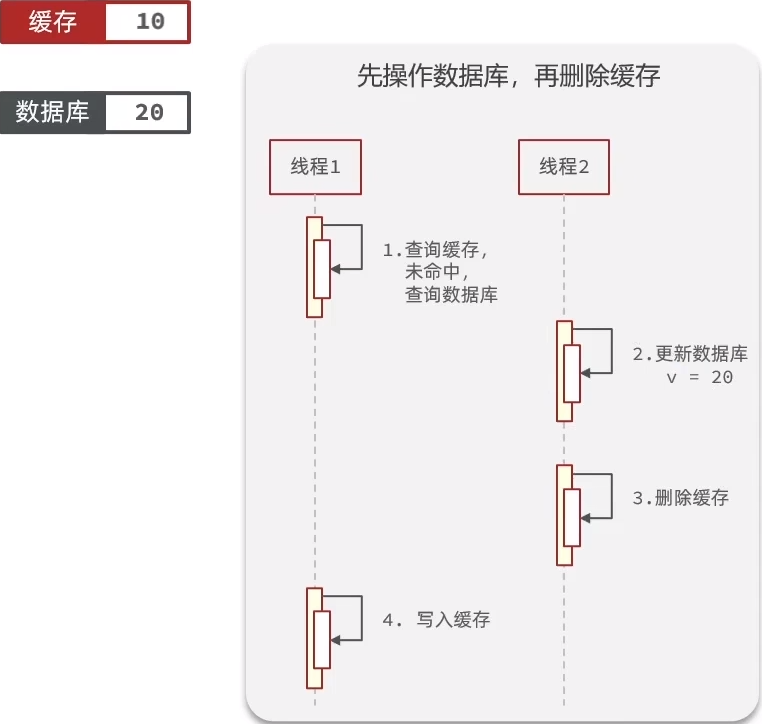
> 但是这个发生的情况概率很小，所以一般采用他

查询与更新模块：

```java

@Service
@Slf4j
public class ShopServiceImpl extends ServiceImpl<ShopMapper, Shop> implements IShopService {
    @Autowired
    private StringRedisTemplate redisTemplate;

    @Override
    public R<Shop> queryShopById(Long id) {
        String shopKey = RedisConstants.CACHE_SHOP_KEY + id;
        //从redis中查询缓存
        String shopJson = redisTemplate.opsForValue().get(shopKey);
        if (StrUtil.isNotBlank(shopJson)) {//查询不为空就直接返回
            log.info("redis缓存命中");
            //命中重新刷新有效期
            redisTemplate.expire(shopKey, RedisConstants.CACHE_SHOP_TTL, TimeUnit.MINUTES);
            Shop shop = JSONUtil.toBean(shopJson, Shop.class);
            return R.ok(shop);
        }
        //查询数据库
        Shop shop = getById(id);
        if (shop == null) {//不存在就返回错误
            log.info("数据库未查询到");
            return R.error("商家不存在");
        }
        //将对象转为json
        shopJson = JSONUtil.toJsonStr(shop);
        //存入redis,10分钟失效
        redisTemplate.opsForValue().set(shopKey, shopJson, RedisConstants.CACHE_SHOP_TTL, TimeUnit.MINUTES);
        return R.ok(shop);
    }

    @Override
    @Transactional//添加事务
    public R<Object> updateShop(Shop shop) {
        Long id = shop.getId();
        if (id == null) {
            return R.error("ID不能为空");
        }
        //更新数据库
        updateById(shop);
        //删除redis缓存
        redisTemplate.delete(RedisConstants.CACHE_SHOP_KEY + shop.getId());

        return R.ok();
    }
}
```

## 3.4缓存穿透

缓存穿透是指客户端请求的数据在缓存中和数据库中都不存在，这样缓存永远不会生效，这些请求都会打到数据库。

### 3.4.1解决方案

#### 3.4.1.1缓存空对象

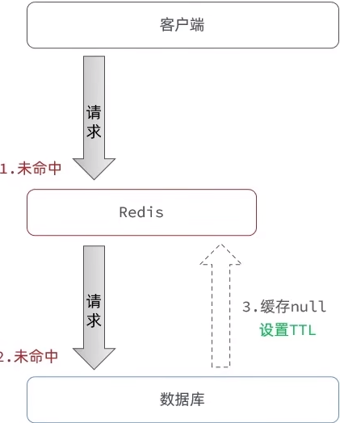

- 优点：实现简单，维护容易
- 缺点：
    - 额外消耗内存
    - 可能造成短期的不一致（TTL+添加数据时加入缓存解决）

#### 3.4.1.2布隆过滤器

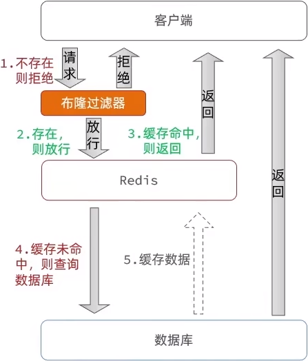

- 优点：内存占用少，没有多余的key
- 缺点：
    - 实现复杂
    - 存在误判可能

### 3.4.2实施方案

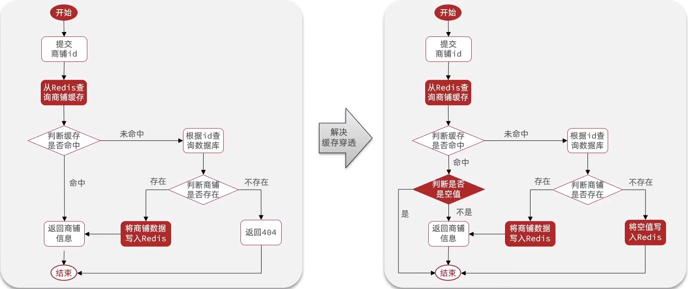

修改原来的查询

```java

@Service
@Slf4j
public class ShopServiceImpl extends ServiceImpl<ShopMapper, Shop> implements IShopService {
    @Autowired
    private StringRedisTemplate redisTemplate;

    @Override
    public R<Shop> queryShopById(Long id) {
        String shopKey = RedisConstants.CACHE_SHOP_KEY + id;
        //从redis中查询缓存
        String shopJson = redisTemplate.opsForValue().get(shopKey);
        if (StrUtil.isNotBlank(shopJson)) {//查询不为空就直接返回
            log.info("redis缓存命中");
            //命中重新刷新有效期
            redisTemplate.expire(shopKey, RedisConstants.CACHE_SHOP_TTL, TimeUnit.MINUTES);
            Shop shop = JSONUtil.toBean(shopJson, Shop.class);
            return R.ok(shop);
        }
        //shopJson is '/t/n' | "" | null 就会到这里
        if (shopJson != null) {//不为null就是空字符
            return R.error("商家不存在");
        }
        //查询数据库
        Shop shop = getById(id);
        if (shop == null) {//不存在就返回错误
            log.info("数据库未查询到");
            //将空值写入redis
            redisTemplate.opsForValue().set(shopKey, "", RedisConstants.CACHE_NULL_TTL, TimeUnit.MINUTES);
            return R.error("商家不存在");
        }
        //将对象转为json
        shopJson = JSONUtil.toJsonStr(shop);
        //存入redis,10分钟失效
        redisTemplate.opsForValue().set(shopKey, shopJson, RedisConstants.CACHE_SHOP_TTL, TimeUnit.MINUTES);
        return R.ok(shop);
    }
}
```

## 3.5缓存雪崩

缓存雪崩是指在同一时段大量的缓存key同时失效或者Redis服务宕机，导致大量请求到达数据库，带来巨大压力。

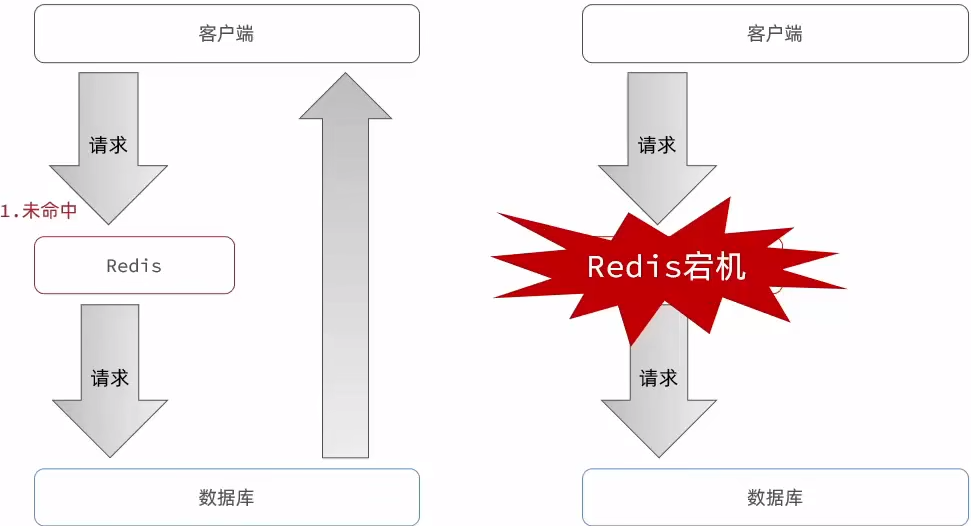

### 3.5.1解决方案

#### 3.5.1.1给不同的key的TTL添加随机值

#### 3.5.1.2利用Redis集群提高服务可用性

#### 3.5.1.3给缓存服务添加降级限流服务

#### 3.5.1.4给业务添加多级缓存

## 3.6缓存击穿

缓存击穿问题也叫热点Key问题，就是一个被高并发访问并且缓存重建业务较复杂的key突然失效了，无数的请求访问会在瞬间给数据库带来巨大的冲击。

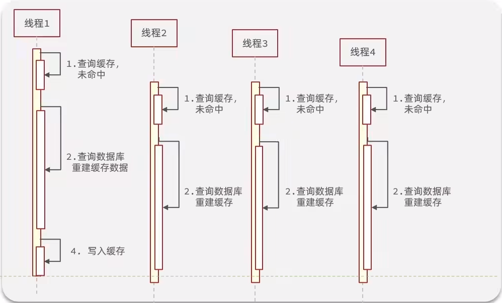

### 3.6.1解决方案

#### 3.6.1.1互斥锁

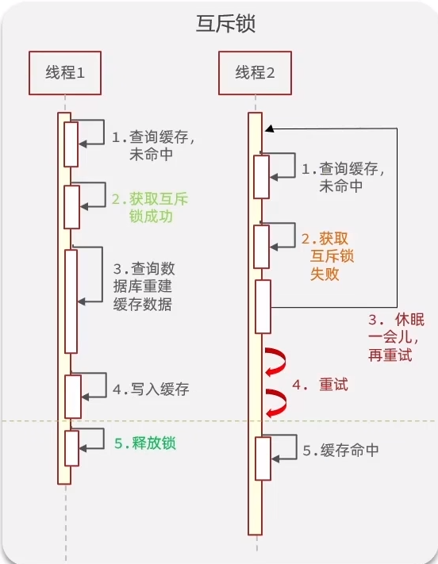

#### 3.6.1.2逻辑过期

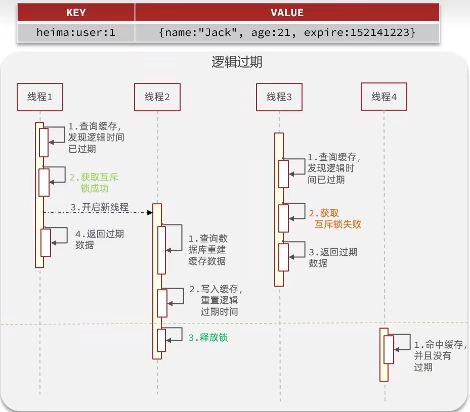

### 3.6.2优缺点

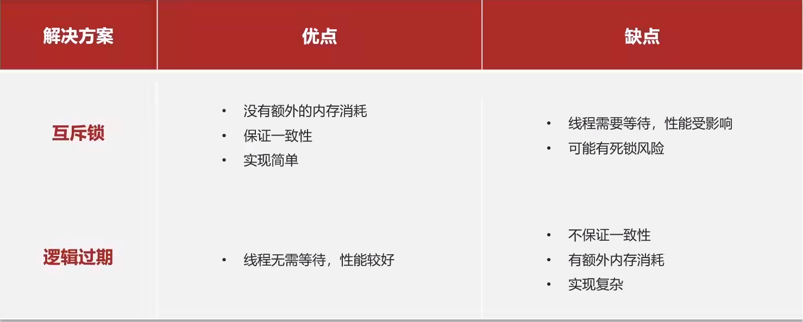

### 3.6.3互斥锁实现

需求：修改根据id查询店铺的业务，基于互斥锁方式实现缓存击穿问题

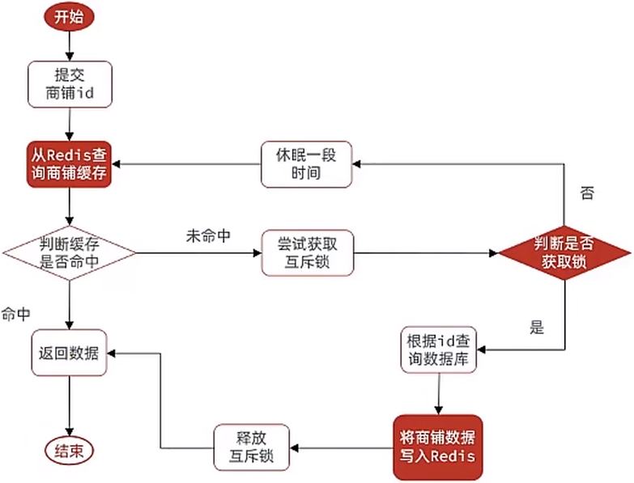

```java

@Service
@Slf4j
public class ShopServiceImpl extends ServiceImpl<ShopMapper, Shop> implements IShopService {
    @Autowired
    private StringRedisTemplate redisTemplate;

    @Override
    public R<Shop> queryShopById(Long id) {
        //缓存穿透是实现
        //Shop shop = queryWithPassThrough(id);
        //缓存击穿实现
        Shop shop = queryWithMutex(id);
        return shop == null ? R.error("店铺id有误") : R.ok(shop);
    }

    private Shop queryWithMutex(Long id) {
        String shopKey = RedisConstants.CACHE_SHOP_KEY + id;
        //从redis中查询缓存
        String shopJson = redisTemplate.opsForValue().get(shopKey);
        if (StrUtil.isNotBlank(shopJson)) {//查询不为空就直接返回
            log.info("redis缓存命中");
            //命中重新刷新有效期
            redisTemplate.expire(shopKey, RedisConstants.CACHE_SHOP_TTL, TimeUnit.MINUTES);
            return JSONUtil.toBean(shopJson, Shop.class);
        }
        //shopJson is '/t/n' | "" | null 就会到这里
        if (shopJson != null) {//不为null就是空字符
            return null;
        }
        //拼接锁的key
        String lockKey = RedisConstants.LOCK_SHOP_KEY + id;
        Shop shop = null;
        try {
            //获取锁
            boolean isLock = tryLock(lockKey);
            if (!isLock) {//获取锁失败
                //线程睡眠一会重试
                TimeUnit.MILLISECONDS.sleep(50);
                return queryWithMutex(id);
            }
            //获取到了锁就去查数据库
            shop = getById(id);
            //模拟重建时间延时
            TimeUnit.MILLISECONDS.sleep(400);
            if (shop == null) {//不存在就返回错误
                log.info("数据库未查询到");
                //将空值写入redis
                redisTemplate.opsForValue().set(shopKey, "", RedisConstants.CACHE_NULL_TTL, TimeUnit.MINUTES);
                return null;
            }
            //将对象转为json
            shopJson = JSONUtil.toJsonStr(shop);
            //存入redis,10分钟失效
            redisTemplate.opsForValue().set(shopKey, shopJson, RedisConstants.CACHE_SHOP_TTL, TimeUnit.MINUTES);
        } catch (InterruptedException e) {
            throw new RuntimeException(e);
        } finally {
            //释放锁
            unlock(lockKey);
        }
        return shop;
    }

    private Shop queryWithPassThrough(Long id) {
        String shopKey = RedisConstants.CACHE_SHOP_KEY + id;
        //从redis中查询缓存
        String shopJson = redisTemplate.opsForValue().get(shopKey);
        if (StrUtil.isNotBlank(shopJson)) {//查询不为空就直接返回
            log.info("redis缓存命中");
            //命中重新刷新有效期
            redisTemplate.expire(shopKey, RedisConstants.CACHE_SHOP_TTL, TimeUnit.MINUTES);
            return JSONUtil.toBean(shopJson, Shop.class);
        }
        //shopJson is '/t/n' | "" | null 就会到这里
        if (shopJson != null) {//不为null就是空字符
            return null;
        }
        //查询数据库
        Shop shop = getById(id);
        if (shop == null) {//不存在就返回错误
            log.info("数据库未查询到");
            //将空值写入redis
            redisTemplate.opsForValue().set(shopKey, "", RedisConstants.CACHE_NULL_TTL, TimeUnit.MINUTES);
            return null;
        }
        //将对象转为json
        shopJson = JSONUtil.toJsonStr(shop);
        //存入redis,10分钟失效
        redisTemplate.opsForValue().set(shopKey, shopJson, RedisConstants.CACHE_SHOP_TTL, TimeUnit.MINUTES);
        return shop;
    }

    @Override
    @Transactional//添加事务
    public R<Object> updateShop(Shop shop) {
        Long id = shop.getId();
        if (id == null) {
            return R.error("ID不能为空");
        }
        //更新数据库
        updateById(shop);
        //删除redis缓存
        redisTemplate.delete(RedisConstants.CACHE_SHOP_KEY + shop.getId());

        return R.ok();
    }


    private boolean tryLock(String key) {
        Boolean flag = redisTemplate.opsForValue().setIfAbsent(key, "1", 10, TimeUnit.SECONDS);
        //不要直接返回flag，因为Boolean是类，可能存在null的情况
        return BooleanUtil.isTrue(flag);
    }

    private void unlock(String key) {
        redisTemplate.delete(key);
    }
}
```

### 3.6.4逻辑过期实现

需求:修改根据id查询商铺的业务，基于逻辑过期方式来解决缓存击穿问题

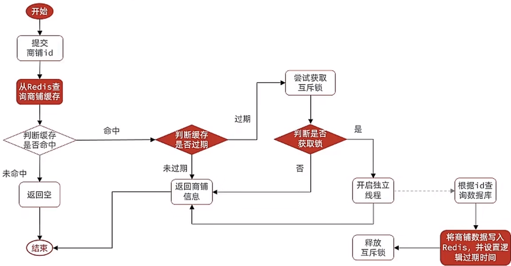

### 3.6.5缓存工具封装（Utils.CacheClient）

#### 3.6.5.1将任意|ava对象序列化为ison并存储在string类型的key中，并且可以设置TTL过期时间

#### 3.6.5.2将任意Java对象序列化为json并存储在string类型的key中，并且可以设置逻辑过期时间，用于处理缓存击穿问题

#### 3.6.5.3根据指定的key查询缓存，并反序列化为指定类型，利用缓存空值的方式解决缓存穿透问题

#### 3.6.5.4根据指定的key查询缓存，并反序列化为指定类型，需要利用逻辑过期解决缓存击穿问题

# 4.秒杀

## 4.1全局唯一ID

当用户抢购的时候，就会生成订单并保存到数据库中，而订单如果使用数据库的自增长ID会出现如下wenti

- id分规律性太明显
- 受到表数据量的限制

### 4.1.1全局ID生成器

全局ID生成器，是一种分布式系统中用来生成全局唯一ID的工具，一般满足如下特性：

- 唯一性
- 高可用
- 高性能
- 递增性
- 安全性

为了增加Id的安全性，我们可以不直接使用Redis的自增的数值，而是拼接一些其他信息:

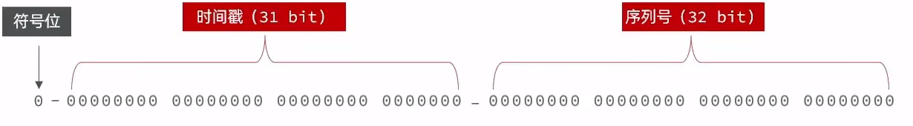

ID的组成部分：

- 符号位：1bit，永远为0
- 时间戳：41bit，以秒为单位，可以使用69年
- 序列号：秒内的计时器，支持每秒产生2^32个不同的ID

全局ID生成策略：

- UUID
- redis自增
- snowflake算法
- 数据库自增

数据库自增ID策略：

- 每天一个key，方便后续的统计订单量
- ID构造是 时间戳 + 计数器

## 4.2实现优惠卷秒杀下单

每个店铺都可以发布优惠卷，分为平价券和特价券。平价券可以任意购买，为特价卷需要秒杀抢购：


### 4.2.1表关系

- tb_voucher：优惠券的基本信息，优惠金额，使用规则
- tb_seckill_voucher：优惠券的库存，开始抢购时间，结束抢购时间。特价优惠券才需要填写这些信息

### 4.2.2实现优惠券秒杀下单

下单时需要判断两点：

- 秒杀是否开始过结束，如果尚未开始或已经结束无法下单
- 库存是否充足，不足则无法下单

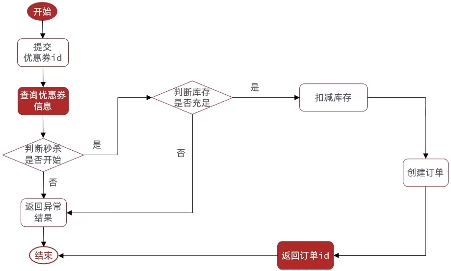

```java

@Service
public class VoucherOrderServiceImpl extends ServiceImpl<VoucherOrderMapper, VoucherOrder> implements IVoucherOrderService {
    @Autowired
    private ISeckillVoucherService seckillVoucherService;

    @Autowired
    private RedisIdWorker idWorker;

    @Override
    @Transactional//涉及到两张表的操作，所以要添加事务
    public R<Object> seckillVouCher(Long voucherId) {
        //查询优惠卷
        SeckillVoucher voucher = seckillVoucherService.getById(voucherId);
        //判断秒杀是否开始
        LocalDateTime nowTime = LocalDateTime.now();
        if (voucher.getBeginTime().isAfter(nowTime)) {//now begin,还没有开始
            return R.error("秒杀还未开始");
        }
        //判断秒杀是否结束
        if (nowTime.isAfter(voucher.getEndTime())) {//end now ，结束
            return R.error("秒杀已经结束");
        }
        //判断库存是否充足
        if (voucher.getStock() < 1) {//库存不存在
            return R.error("库存不足");
        }
        //扣减库存
        boolean success = seckillVoucherService.update()
                .setSql("stock = stock - 1")
                .eq("voucher_id", voucherId)
                .update();
        if (!success) {//库存扣减失败
            return R.error("库存不足");
        }
        //创建订单
        VoucherOrder voucherOrder = new VoucherOrder();
        long orderId = idWorker.nextId("order");
        voucherOrder.setId(orderId);//设置订单id
        voucherOrder.setUserId(UserDtoHolder.getUser().getId());//设置用户id
        voucherOrder.setVoucherId(voucherId);//设置订单id
        save(voucherOrder);
        //返回订单id
        return R.ok(orderId);
    }
}
```

## 4.3超卖问题

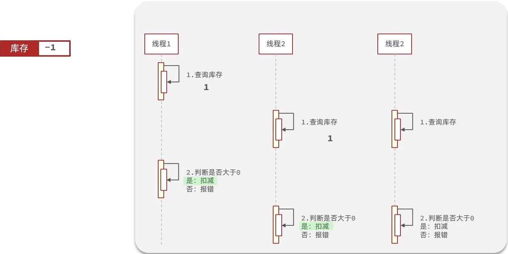

超卖问题是典型的多线程安全问题，针对这一问题的常见解决方案就是加锁:

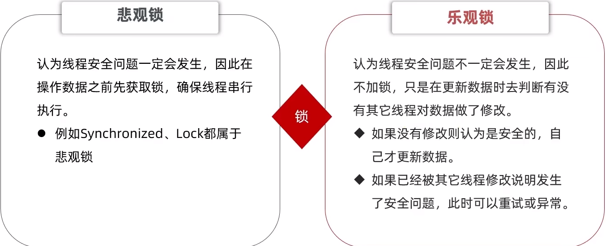

### 4.3.1版本号法

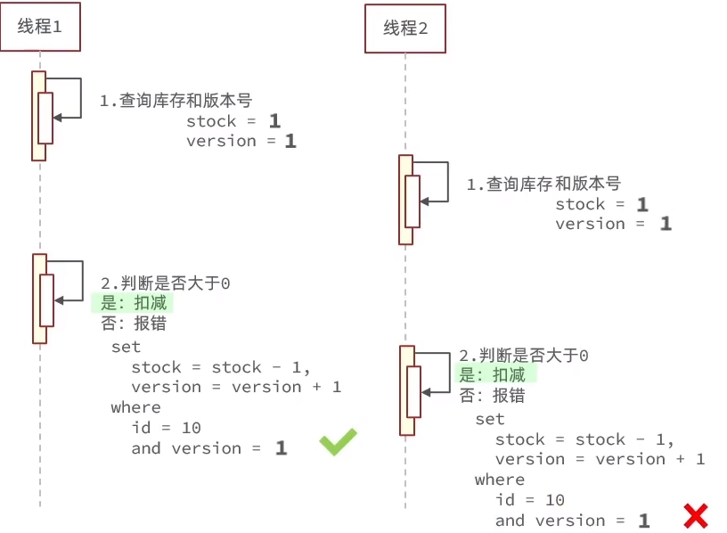

悲观锁：添加同步锁，让线程串行执行

- 优点：简单粗暴
- 缺点：性能一般

乐观锁：不加锁，在更新阶段时判断是否有其他线程在修改

- 优点：性能号
- 缺点：存在成功率滴的问题

## 4.4一人一单

需求：修改秒杀业务，要求同一个优惠券，一个用户只能下一单

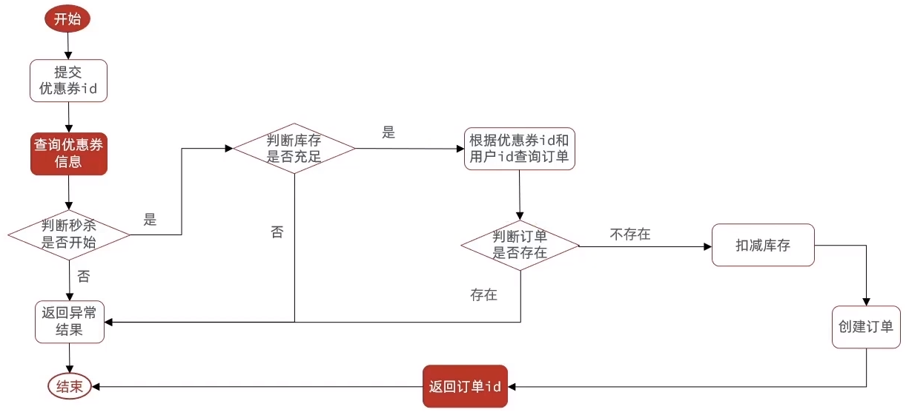

```java

@Service
@Slf4j
public class VoucherOrderServiceImpl extends ServiceImpl<VoucherOrderMapper, VoucherOrder> implements IVoucherOrderService {
    @Autowired
    private ISeckillVoucherService seckillVoucherService;

    @Autowired
    private RedisIdWorker idWorker;

    @Override
    public R<Object> seckillVouCher(Long voucherId) {
        //查询优惠卷
        SeckillVoucher voucher = seckillVoucherService.getById(voucherId);
        //        log.info("====voucher: {}", voucher);
        //判断秒杀是否开始
        LocalDateTime nowTime = LocalDateTime.now();
        if (voucher.getBeginTime().isAfter(nowTime)) {//now begin,还没有开始
            return R.error("秒杀还未开始");
        }
        //判断秒杀是否结束
        if (nowTime.isAfter(voucher.getEndTime())) {//end now ，结束
            return R.error("秒杀已经结束");
        }
        //        log.info("====stock: {}", voucher.getStock());
        //判断库存是否充足
        if (voucher.getStock() < 1) {//库存不存在
            return R.error("库存不足");
        }
        Long userId = UserDtoHolder.getUser().getId();
        synchronized (userId.toString().intern()) {
            IVoucherOrderService proxy = (IVoucherOrderService) AopContext.currentProxy();
            return proxy.createVoucherOrder(voucherId, voucher);
        }
    }


    @Transactional
    public R<Object> createVoucherOrder(Long voucherId, SeckillVoucher voucher) {
        Long userId = UserDtoHolder.getUser().getId();
        //一人一单
        Integer count = query().eq("user_id", userId).eq("voucher_id", voucherId).count();
        if (count > 0) {//已购买
            return R.error("该优惠券用户已经购买过了");
        }
        //扣减库存
        boolean success = seckillVoucherService.update()
                .setSql("stock = stock - 1")
                .eq("voucher_id", voucherId)
                .gt("stock", 0)
                .update();
        if (!success) {//库存扣减失败
            return R.error("库存不足");
        }
        log.info("下订单");
        //创建订单
        VoucherOrder voucherOrder = new VoucherOrder();
        long orderId = idWorker.nextId("order");
        voucherOrder.setId(orderId);//设置订单id
        voucherOrder.setUserId(userId);//设置用户id
        voucherOrder.setVoucherId(voucherId);//设置订单id
        save(voucherOrder);
        //返回订单id
        return R.ok(orderId);
    }
}
```

通过上面的加锁我们在单机的情况下的一人一单的安全问题，但是集群模式就不行了。

1.将服务启动两份，端口分别为8001和8002：

2.然后修改nginx的conf目录的nginx.conf文件，配置反向代理和负载均衡：

```text
    server {
        listen       8080;
        server_name  localhost;
        # 指定前端项目所在的位置
        location / {
            root   html/hmdp;
            index  index.html index.htm;
        }

        error_page   500 502 503 504  /50x.html;
        location = /50x.html {
            root   html;
        }


        location /api {  
            default_type  application/json;
            #internal;  
            keepalive_timeout   30s;  
            keepalive_requests  1000;  
            #支持keep-alive  
            proxy_http_version 1.1;  
            rewrite /api(/.*) $1 break;  
            proxy_pass_request_headers on;
            #more_clear_input_headers Accept-Encoding;  
            proxy_next_upstream error timeout;  
#             proxy_pass http://127.0.0.1:8081;
            proxy_pass http://backend;
        }
    }

    upstream backend {
        server 127.0.0.1:8081 max_fails=5 fail_timeout=10s weight=1;
        server 127.0.0.1:8082 max_fails=5 fail_timeout=10s weight=1;
    }  
```

### 4.4.1单体服务

#### 加锁前：

正常情况
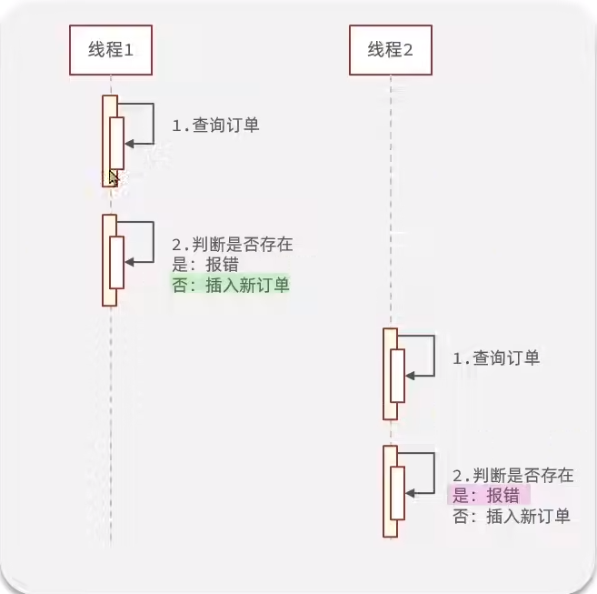

异常情况
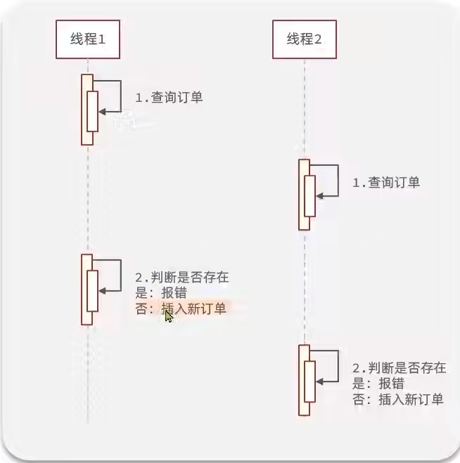

#### 加锁后：

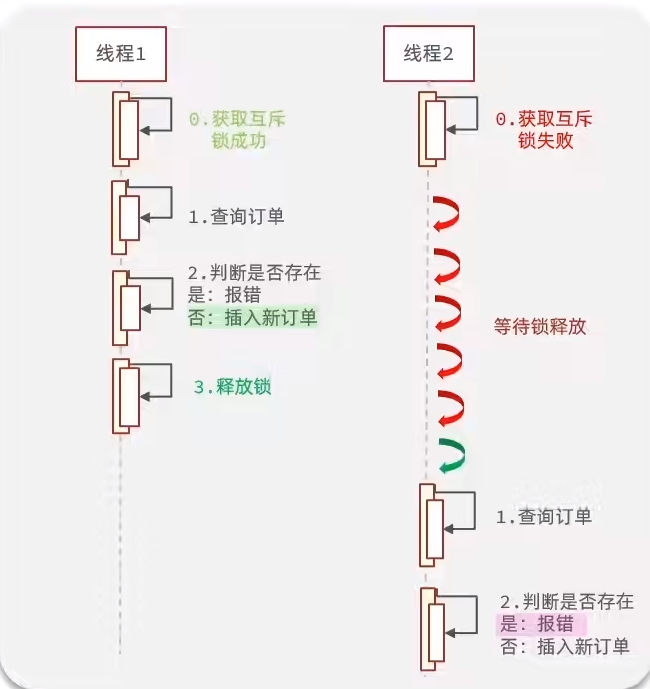

### 4.4.2集群服务

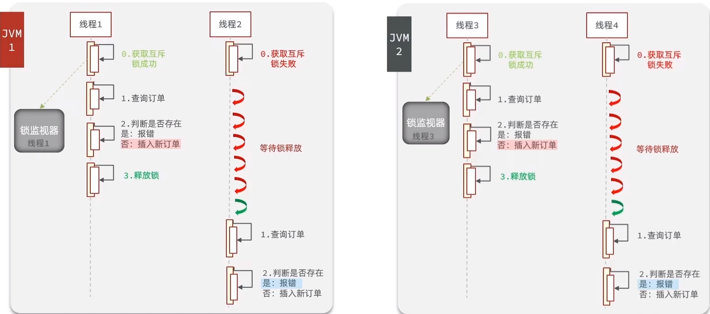

## 4.5分布式锁

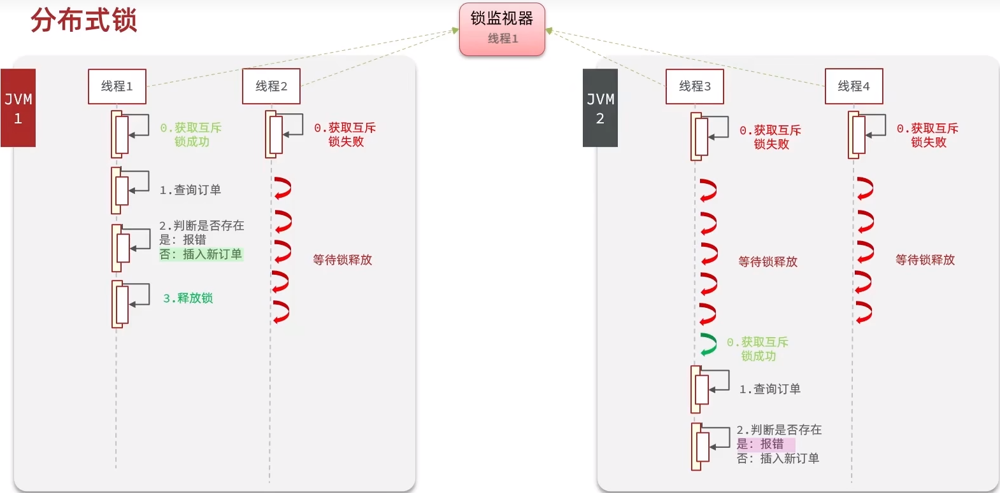

**分布式锁：满足分布式系统过集群模式下多个进程可见并且互斥的锁**

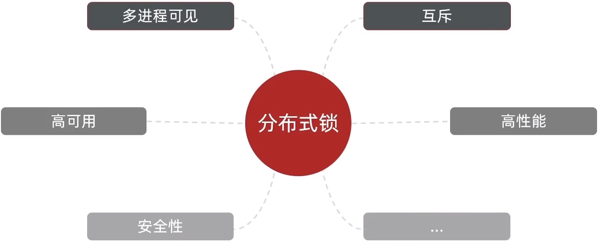

### 4.5.1分布式锁的实现

分布式锁的核心是实现多线程之间的互斥，而满足这一点的方式有很多，常见的有三种：

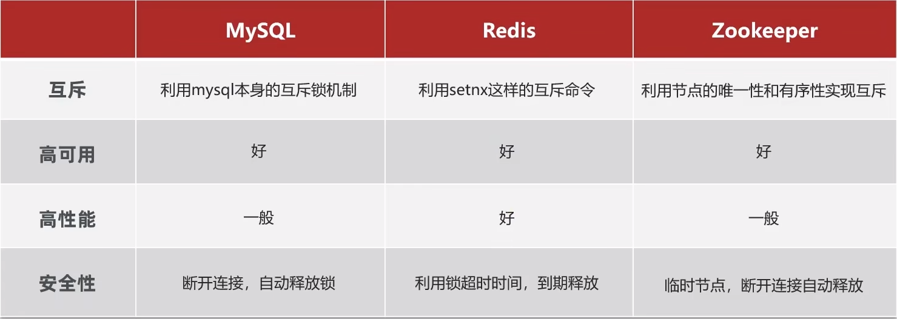

### 4.5.2基于redis的分布式锁

实现分布式锁时需要实现两个基础的方法：

- 获取锁
    - 互斥：确保只能有一个线程获取锁

  

- 释放锁
    - 手动释放
    - 超时释放
        - SET lock threadName EX 10 NX 单位：second

  

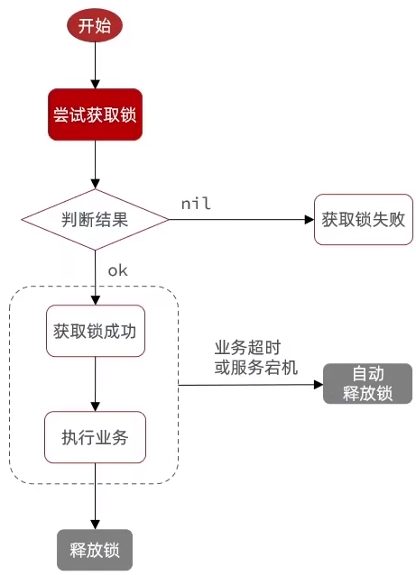

### 4.5.3基于Redis实现分布式锁的初步方案

需求：定义一个类，实现接口，利用redis实现分布式锁

```java
public interface ILock() {
    /**
     * 尝试获取锁
     * @param timeoutSec 锁持有时间，超时锁自动释放
     * @return 返回获取锁是否成功
     */
    boolean tryLock(long timeoutSec);

    /**
     * 释放锁
     */
    void unlock();
}
```

VoucherOrderServiceImpl类

```java

@Service
@Slf4j
public class VoucherOrderServiceImpl extends ServiceImpl<VoucherOrderMapper, VoucherOrder> implements IVoucherOrderService {
    @Autowired
    private ISeckillVoucherService seckillVoucherService;

    @Autowired
    private RedisIdWorker idWorker;

    @Autowired
    private StringRedisTemplate redisTemplate;

    @Override
    public R<Object> seckillVouCher(Long voucherId) {
        //查询优惠卷
        SeckillVoucher voucher = seckillVoucherService.getById(voucherId);
//        log.info("====voucher: {}", voucher);
        //判断秒杀是否开始
        LocalDateTime nowTime = LocalDateTime.now();
        if (voucher.getBeginTime().isAfter(nowTime)) {//now begin,还没有开始
            return R.error("秒杀还未开始");
        }
        //判断秒杀是否结束
        if (nowTime.isAfter(voucher.getEndTime())) {//end now ，结束
            return R.error("秒杀已经结束");
        }
//        log.info("====stock: {}", voucher.getStock());
        //判断库存是否充足
        if (voucher.getStock() < 1) {//库存不存在
            return R.error("库存不足");
        }
        Long userId = UserDtoHolder.getUser().getId();
        //创建锁对象
        SimpleRedisLock lock = new SimpleRedisLock("order:" + userId, redisTemplate);
        boolean isLock = lock.tryLock(3);
        if (!isLock) {
            return R.error("当前用户操作频繁，请稍后重试");
        }
        try {
            IVoucherOrderService proxy = (IVoucherOrderService) AopContext.currentProxy();
            return proxy.createVoucherOrder(voucherId, voucher);
        } catch (IllegalStateException e) {
            throw new RuntimeException(e);
        } finally {
            lock.unlock();
        }
    }


    @Transactional
    public R<Object> createVoucherOrder(Long voucherId, SeckillVoucher voucher) {
        Long userId = UserDtoHolder.getUser().getId();
        //一人一单
        Integer count = query().eq("user_id", userId).eq("voucher_id", voucherId).count();
        if (count > 0) {//已购买
            return R.error("该优惠券用户已经购买过了");
        }
        //扣减库存
        boolean success = seckillVoucherService.update()
                .setSql("stock = stock - 1")
                .eq("voucher_id", voucherId)
                .gt("stock", 0)
                .update();
        if (!success) {//库存扣减失败
            return R.error("库存不足");
        }
        log.info("下订单");
        //创建订单
        VoucherOrder voucherOrder = new VoucherOrder();
        long orderId = idWorker.nextId("order");
        voucherOrder.setId(orderId);//设置订单id
        voucherOrder.setUserId(userId);//设置用户id
        voucherOrder.setVoucherId(voucherId);//设置订单id
        save(voucherOrder);
        //返回订单id
        return R.ok(orderId);
    }
}
```

方案问题：

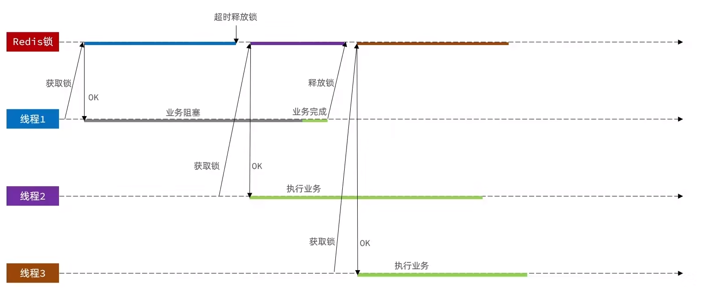

### 4.5.4改进Redis分布式锁

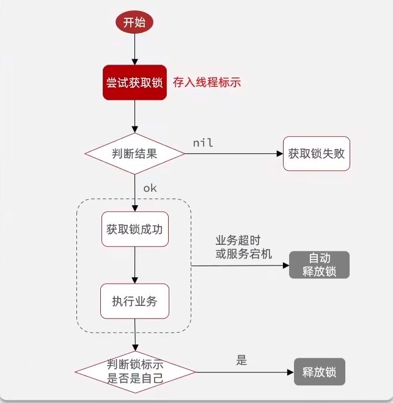

需求：修改之前的分布式锁实现，满足：

- 在获取锁时存入线程标示（可以用UUID）
- 在释放锁时先获取锁中的标示，判断是否与当前线程标示一直
    - 不一致不释放
    - 一致释放

```java

@Data
@Slf4j
public class SimpleRedisLock implements ILock {
    private String name;
    private static final String KEY_PREFIX = "lock:";
    private static final String ID_PREFIX = UUID.randomUUID().toString(true) + "-";
    private StringRedisTemplate redisTemplate;

    public SimpleRedisLock() {
    }

    public SimpleRedisLock(String name, StringRedisTemplate redisTemplate) {
        this.name = name;
        this.redisTemplate = redisTemplate;
    }

    @Override
    public boolean tryLock(long timeoutSec) {
        log.info("key: " + KEY_PREFIX + name);
        //获取当前线程id
        String currentThreadId = ID_PREFIX + Thread.currentThread().getId();

        Boolean b = redisTemplate.opsForValue().setIfAbsent(KEY_PREFIX + name, currentThreadId, timeoutSec, TimeUnit.SECONDS);
        return Boolean.TRUE.equals(b);
    }

    @Override
    public void unlock() {
        String currentThreadId = ID_PREFIX + Thread.currentThread().getId();//当前线程ID
        String threadId = redisTemplate.opsForValue().get(KEY_PREFIX + name);//获取key对应的线程ID
        //没有获取到或当前线程id与redis中锁住的线程id不同就返回
        if (threadId == null || !threadId.equals(currentThreadId)) {
            return;
        }
        redisTemplate.delete(KEY_PREFIX + name);
    }
}
```

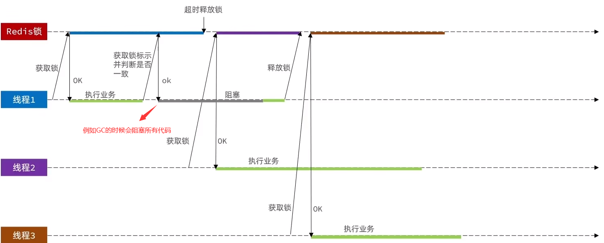

> 意思就是获取锁标示与释放锁是两动作，这两个动作之间出现了阻塞就会出现上面的问题，应该保证这两个动作的原子性，需要后面的Lua脚本解决

## 4.6Redis的Lua脚本

Redis提供了Lua脚本功能，在一个脚本中编写多条Redis命令，确保多条命令执行时的原子性。Lua是一种编程语言，它的基本语法大家可以参考网站: https://www.runoob.com/lua/lua-tutorial.html

执行redis命令：

```text
redis.call('命令名称', 'key', '其他参数'...)
```

写好脚本后，需要用redis命令调用脚本，命令如下：

```text
EVAL script numkeys key [key ...] arg [arg ...]
```

例如，我们执行`redis.call('set', 'name', 'jack')`脚本语法如下：

```text
EVAL "return redis.call('set', 'name', 'jack')" 0
```

如果脚本中的key、value不想写死，可以作为参数传递。key类型参数会放入KEYS数组，其它参数会放入ARGV数组，在脚本中可以从KEYS和ARGV数组获取这些参数:

```text
EVAL "return redis.call('set', KEYS[1], ARGV[1])" 1 name Rose
// 1：脚本需要的key类型的参数个数
```

> Lua中数字是从下标1开始的

### 4.6.1释放锁的流程

- 获取锁中标示
- 判断是否与指定的标示（当前线程标示）一致
- 如果一致则释放锁（删除）
- 如果不一致返回

## 4.6.2再次改进Redis的分布式锁

需求：基于Lua脚本实现分布式锁的释放锁逻辑

提示：RedisTemplate调用Lua脚本API如下：

```text
public <T> T execute(RedisScript<T> script, List<K> keys, Object... args) {
    return this.scriptExecutor.execute(script, keys, args);
}
```

修改SimpleRedisLock

```text
@Override
public void unlock() {
    //调用lua脚本
    redisTemplate.execute(
            UNLOCK_SCRIPT,
            Collections.singletonList(KEY_PREFIX + name),
            ID_PREFIX + Thread.currentThread().getId()
            );
}
```

基于setnx实现的分布式锁存在下面问题：


解决方案：使用Redisson

## 4.7Redisson

Redisson是一个在Redis的基础上实现的Java驻内存数据网格（Iln-Memory Data Grid)
。它不仅提供了一系列的分布式的Java常用对象，还提供了许多分布式服务，其中就包含了各种分布式锁的实现。

分布式锁（lock）和同步器（Synchronizer）

- 可重入锁（Reentrant Lock）
- 公平锁（Fair Lock）
- 联锁（MultiLock）
- 红锁（RedLock）
- 读写锁（ReadWriteLock）
- 信号量（Semaphore）
- 可过期性信号量（PermitExpireSemaphore）

官网地址: https://redisson.org

GitHub地址: https://github.com/redisson/redisson

### 4.7.1Redisson快速入门

引入依赖

```xml
<dependency>
    <groupId>org.redisson</groupId>
    <artifactId>redisson</artifactId>
    <version>3.13.6</version>
</dependency>
```

配置Redisson客户端

```java

@Configuration
public class RedisConfig {
    @Value("${spring.redis.host}")
    private String redisAddr;

    @Value("${spring.redis.port")
    private String port;

    @Value("${spring.redis.password}")
    private String password;

    @Bean
    public RedissonClient redissonClient() {
        // 配置类
        Config config = new Config();
        // 添加redis地址，这里添加了单点地址，也可以使用config.useClusterServers()添加集群地址
        config.useSingleServer().setAddress("redis://" + redisAddr + ":" + port).setPassword(password);
        return Redisson.create(config);
    }
}
```

使用Redisson分布式锁

```java
class HmDianPingApplicationTests {
    @Autowired
    private RedissonClient redissonClient;

    @Test
    public void testRedisson() throws InterruptedException {
        //获取锁（可重入），指定锁名称
        RLock lock = redissonClient.getLock("anyLock");
        //尝试获取锁，参数分别是：获取锁的最大等待时间（期间会重试），锁自动释放时间，时间单位
        boolean isLock = lock.tryLock(1, 10, TimeUnit.SECONDS);
        //判断释放获取成功
        if (isLock) {
            try {
                System.out.println("执行业务");
            } finally {
                //释放锁
                lock.unlock();
            }
        }
    }
}
```

### 4.7.2Redisson可重入锁原理
可以类比立即JUC编程中的ReentrantLock的可重入原理

https://www.bilibili.com/video/BV1cr4y1671t?p=66


