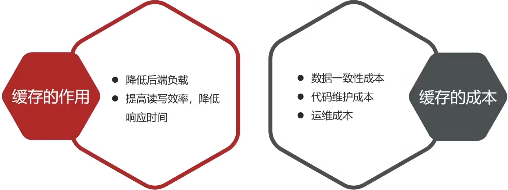

# 黑马点评项目

# 1.项目启动

## 1.1数据导入
### 1.1.1在自己的MySQL中创建hmdp数据库
```mysql
create database hmdp;
```
### 1.1.2执行sql文件
使用mysql的图形化客户端将resource/db/hmdp.sql执行

## 1.2后端项目启动

### 1.2.1启动引导类

### 1.2.2测试项目是否成功
访问 http://localhost:8081/shop-type/list 是否有数据显示

## 1.3前端启动
在nginx-1.18.0文件夹使用cmd或IDEA的Terminal打开执行指令：
```shell
start .\nginx.exe # 开启nginx服务
.\nginx.exe -s stop # 停止nginx服务
```
然后访问 http://localhost:8080即可

# 2.登录
## 2.1基于Session实现登录

> 缺点：session不能共享，在做服务器集群的时候，让多台服务器之间共享session不好
> 且session是基于cookie实现的，浏览器如果禁用cookie，session也不能使用了，将状态保存在服务器端,占用服务器内存,如果用户量过大,会严重影响服务器的性能，且过期时间不是很灵活

## 2.2redis实现短信登录功能


### 2.2.1短信密码登录注册
```java
@Service
@Slf4j
public class UserServiceImpl extends ServiceImpl<UserMapper, User> implements IUserService {
    @Autowired
    private StringRedisTemplate redisTemplate;
    @Override
    public R<Object> sendCode(String phone, HttpSession session) {
        //校验手机号码
        if (RegexUtils.isPhoneInvalid(phone)) {
            //手机号有误返回
            return R.error("手机号格式有误！");
        }
        //生成验证码
        String code = RandomUtil.randomNumbers(6);
        //保存到redis中，code两分钟过期，RedisConstants类是记录常量类
        redisTemplate.opsForValue().set(RedisConstants.LOGIN_CODE_KEY +phone, code,
                RedisConstants.LOGIN_CODE_TTL, TimeUnit.MINUTES);
        //发送验证码
        log.info("验证码 = {}", code);
        return R.ok();
    }

    @Override
    public R<Object> login(LoginFormDTO loginForm, HttpSession session) {
        String phone = loginForm.getPhone();
        //验证手机号
        if (RegexUtils.isPhoneInvalid(phone)) {
            //手机号有误返回
            return R.error("手机号格式有误！");
        }
        //生成token，密码登录和电话号登录都使用同一个token
        String token = UUID.randomUUID().toString(true);
        //通过不同登录方式进行验证
        if (loginForm.getCode() != null) {//验证码登录
            return loginByCode(loginForm, session, token);
        }else if (loginForm.getPassword() != null) {//密码登录
            return loginByPassword(loginForm, session, token);
        }
        return R.error("输入的验证码或密码有误");
    }

    private R<Object> loginByPassword(LoginFormDTO loginForm, HttpSession session, String token) {
        //查询手机号是否注册
        LambdaQueryWrapper<User> queryWrapper = new LambdaQueryWrapper<>();
        queryWrapper.eq(User::getPhone, loginForm.getPhone());
        User user = this.getOne(queryWrapper);
        if(user == null) {
            log.info("手机号未注册请先注册！");
            return R.error("手机号未注册请先注册！");
        }
        //处理用户密码为空情况
        if (user.getPassword() == null || user.getPassword().length() == 0) {
            log.info("用户密码未设置，请使用短信验证吗登录！");
            return R.error("密码未设置，请使用短信登录！");
        }
        //判断密码是否正确
        if (!user.getPassword().equals(loginForm.getPassword())) {
            return R.error("密码错误！");
        }
        //将用户缓存到redis中
        cacheToRedis(token, user);
        return R.ok();
    }

    private R<Object> loginByCode(LoginFormDTO loginForm, HttpSession session, String token) {
        String phone = loginForm.getPhone();
        //从redis中获取验证码
        String cache = redisTemplate.opsForValue().get(RedisConstants.LOGIN_CODE_KEY+phone);
        log.info("通过验证码登录-Cache: " + cache);
        //缓存验证码不存在了，或验证码有误
        if (cache == null || !cache.equals(loginForm.getCode())) {
            return R.error("验证码有误！");
        }
        //查询该手机号是否注册
        LambdaQueryWrapper<User> queryWrapper = new LambdaQueryWrapper<>();
        queryWrapper.eq(User::getPhone, phone);
        User user = this.getOne(queryWrapper);
        if (user == null) {//用户不存在进行注册
            user = createUserWithPhone(phone);
        }
        //缓存到redis
        cacheToRedis(token, user);
        //返回token
        return R.ok(token);
    }

    private void cacheToRedis(String token, User user) {
        //将User对象转为Hash存储，如果使用json存储就不会有下面转map问题
        UserDto userDto = BeanUtil.copyProperties(user, UserDto.class);
        //对象转Long，解决Long转换问题
        /*
        这里可以自己实现：new一个User，从map中一个个获取通过key去给对象属性值填充
         */
        Map<String, Object> userMap = BeanUtil.beanToMap(userDto, new HashMap<>(),
                CopyOptions.create()
                        .setIgnoreCase(true)
                        .setFieldValueEditor((fieldName, fieldValue) -> fieldValue.toString()));
        //给token添加前缀
        String tokenKey = RedisConstants.LOGIN_USER_KEY+ token;
        //存入redis中
        redisTemplate.opsForHash().putAll(tokenKey, userMap);
        //设置token有效期
        redisTemplate.expire(tokenKey, RedisConstants.CACHE_SHOP_TTL, TimeUnit.MINUTES);
    }

    private User createUserWithPhone(String phone) {
        //创建User
        User user = new User();
        //设置用户电话号
        user.setPhone(phone);
        //初始化用户nickName
        user.setNickName(SystemConstants.USER_NICK_NAME_PREFIX+RandomUtil.randomString(10));
        //保存用户
        save(user);
        return user;
    }
}
```
### 2.2.2拦截器
redis刷新拦截器
```java
@NoArgsConstructor
@AllArgsConstructor
@Slf4j
public class RefreshTokenInterceptor implements HandlerInterceptor {
    private StringRedisTemplate redisTemplate;
    @Override
    public boolean preHandle(HttpServletRequest request, HttpServletResponse response, Object handler) throws Exception {
        //获取token
        String token = request.getHeader("authorization");
        //token不存在直接放行
        if (token == null) {
            return true;
        }
        String tokenKey = RedisConstants.LOGIN_USER_KEY + token;

        log.info("token刷新拦截器-tokenKey: {}", tokenKey);
        Map<Object, Object> user = redisTemplate.opsForHash().entries(tokenKey);
        //map转对象
        UserDto userDto = BeanUtil.copyProperties(user, UserDto.class);
        //对象存在就记录到ThreadLocal中
        if (userDto != null) {
            //刷新token
            redisTemplate.expire(tokenKey, RedisConstants.CACHE_SHOP_TTL, TimeUnit.MINUTES);
            UserDtoHolder.saveUser(userDto);
        }
        log.info("token刷新拦截器-userDto: {}", UserDtoHolder.getUser());
        //不做连接放行所有的请求
        return true;
    }

    @Override
    public void afterCompletion(HttpServletRequest request, HttpServletResponse response, Object handler, Exception ex) throws Exception {
        HandlerInterceptor.super.afterCompletion(request, response, handler, ex);
    }
}
```
登录拦截器
```java
@Slf4j
@AllArgsConstructor
@NoArgsConstructor
public class LoginInterceptor implements HandlerInterceptor {
    private StringRedisTemplate redisTemplate;
    @Override
    public boolean preHandle(HttpServletRequest request, HttpServletResponse response, Object handler) throws Exception {
        if(request.getHeader("authorization") == null) {
            return true;
        }
        //在ThreadLocal中获取UserDto
        UserDto user = UserDtoHolder.getUser();
        log.info("登录拦截器-userDto: {}", user);
        if (user == null) {
            //把请求拦截了，并返回
            response.setStatus(401);
            return false;
        }
        return true;
    }

    @Override
    public void afterCompletion(HttpServletRequest request, HttpServletResponse response, Object handler, Exception ex) throws Exception {
        UserHolder.removeUser();
    }
}
```
拦截器配置类
```java
@Configuration
public class MvcConfig implements WebMvcConfigurer {
    @Autowired
    private StringRedisTemplate redisTemplate;
    @Override
    public void addInterceptors(InterceptorRegistry registry) {
        registry.addInterceptor(new RefreshTokenInterceptor(redisTemplate)).order(0);
        registry.addInterceptor(new LoginInterceptor(redisTemplate))
                .excludePathPatterns(
                        "/user/code",
                        "/user/login",
                        "/blog/hot",
                        "/shop-type/**",
                        "/upload/**",
                        "/voucher/**",
                        "/shop/**"
                ).order(1);
    }
}
```

# 3.商户查询缓存
## 3.1什么是缓存
缓存就是数据交换的缓冲区（称作Cache)，是存贮数据的临时地方，一般读写性能较高。


## 3.2添加缓存
### 3.2.1缓存作用模型


#### 3.2.2.1基于缓存模型实现
```java
@Service
@Slf4j
public class ShopServiceImpl extends ServiceImpl<ShopMapper, Shop> implements IShopService {
    @Autowired
    private StringRedisTemplate redisTemplate;
    @Override
    public R<Shop> queryShopById(Long id) {
        String shopKey = RedisConstants.CACHE_SHOP_KEY+id;
        //从redis中查询缓存
        String shopJson = redisTemplate.opsForValue().get(shopKey);
        if (StrUtil.isNotBlank(shopJson)) {//查询不为空就直接返回
            log.info("redis缓存命中");
            //命中重新刷新有效期
            redisTemplate.expire(shopKey, RedisConstants.CACHE_SHOP_TTL, TimeUnit.MINUTES);
            Shop shop = JSONUtil.toBean(shopJson, Shop.class);
            return R.ok(shop);
        }
        //查询数据库
        Shop shop = getById(id);
        if (shop == null) {//不存在就返回错误
            log.info("数据库未查询到");
            return R.error("商家不存在");
        }
        //将对象转为json
        shopJson = JSONUtil.toJsonStr(shop);
        //存入redis,10分钟失效
        redisTemplate.opsForValue().set(shopKey, shopJson, RedisConstants.CACHE_SHOP_TTL, TimeUnit.MINUTES);
        return R.ok(shop);
    }
}
```
## 3.3缓存更新策略

业务场景：
- 低一致行：使用内存淘汰机制或超时剔除机制，例如我们店铺类型
- 高一致性：主动更新+超时剔除兜底。如店铺详细的缓存
### 3.3.1主动更新策略


使用第一种操作缓存和数据库的三个问题：
- 删除缓存还是更新缓存
    - 更新缓存：每次更新数据库都是更新缓存，无效写操作较多
    - 删除缓存：更新数据库时让缓存失效，查询时再更新缓存
- 如何保证缓存与数据库的操作同时成功或失败
  - 单体系统，将缓存和数据库操作放在一个事务
  - 分布式系统，利用TCC等分布式事务方案
- 先操作缓存还是数据库
  - 先删除缓存，再操作数据库
  - 先操作数据库，再删除缓存

#### 3.3.1.1先删除缓存，再操作数据库
正常情况：

异常情况：


#### 3.3.1.2
正常情况：

异常情况：

> 但是这个发生的情况概率很小，所以一般采用他

查询与更新模块：
```java
@Service
@Slf4j
public class ShopServiceImpl extends ServiceImpl<ShopMapper, Shop> implements IShopService {
    @Autowired
    private StringRedisTemplate redisTemplate;
    @Override
    public R<Shop> queryShopById(Long id) {
        String shopKey = RedisConstants.CACHE_SHOP_KEY+id;
        //从redis中查询缓存
        String shopJson = redisTemplate.opsForValue().get(shopKey);
        if (StrUtil.isNotBlank(shopJson)) {//查询不为空就直接返回
            log.info("redis缓存命中");
            //命中重新刷新有效期
            redisTemplate.expire(shopKey, RedisConstants.CACHE_SHOP_TTL, TimeUnit.MINUTES);
            Shop shop = JSONUtil.toBean(shopJson, Shop.class);
            return R.ok(shop);
        }
        //查询数据库
        Shop shop = getById(id);
        if (shop == null) {//不存在就返回错误
            log.info("数据库未查询到");
            return R.error("商家不存在");
        }
        //将对象转为json
        shopJson = JSONUtil.toJsonStr(shop);
        //存入redis,10分钟失效
        redisTemplate.opsForValue().set(shopKey, shopJson, RedisConstants.CACHE_SHOP_TTL, TimeUnit.MINUTES);
        return R.ok(shop);
    }

    @Override
    @Transactional//添加事务
    public R<Object> updateShop(Shop shop) {
        Long id = shop.getId();
        if (id == null) {
            return R.error("ID不能为空");
        }
        //更新数据库
        updateById(shop);
        //删除redis缓存
        redisTemplate.delete(RedisConstants.CACHE_SHOP_KEY+shop.getId());

        return R.ok();
    }
}
```
## 3.4缓存穿透
缓存穿透是指客户端请求的数据在缓存中和数据库中都不存在，这样缓存永远不会生效，这些请求都会打到数据库。

### 3.4.1解决方案
#### 3.4.1.1缓存空对象

- 优点：实现简单，维护容易
- 缺点：
  - 额外消耗内存
  - 可能造成短期的不一致（TTL+添加数据时加入缓存解决）

#### 3.4.1.2布隆过滤器

- 优点：内存占用少，没有多余的key
- 缺点：
  - 实现复杂
  - 存在误判可能

### 3.4.2实施方案

修改原来的查询
```java
@Service
@Slf4j
public class ShopServiceImpl extends ServiceImpl<ShopMapper, Shop> implements IShopService {
  @Autowired
  private StringRedisTemplate redisTemplate;

  @Override
  public R<Shop> queryShopById(Long id) {
    String shopKey = RedisConstants.CACHE_SHOP_KEY + id;
    //从redis中查询缓存
    String shopJson = redisTemplate.opsForValue().get(shopKey);
    if (StrUtil.isNotBlank(shopJson)) {//查询不为空就直接返回
      log.info("redis缓存命中");
      //命中重新刷新有效期
      redisTemplate.expire(shopKey, RedisConstants.CACHE_SHOP_TTL, TimeUnit.MINUTES);
      Shop shop = JSONUtil.toBean(shopJson, Shop.class);
      return R.ok(shop);
    }
    //shopJson is '/t/n' | "" | null 就会到这里
    if (shopJson != null) {//不为null就是空字符
      return R.error("商家不存在");
    }
    //查询数据库
    Shop shop = getById(id);
    if (shop == null) {//不存在就返回错误
      log.info("数据库未查询到");
      //将空值写入redis
      redisTemplate.opsForValue().set(shopKey, "", RedisConstants.CACHE_NULL_TTL, TimeUnit.MINUTES);
      return R.error("商家不存在");
    }
    //将对象转为json
    shopJson = JSONUtil.toJsonStr(shop);
    //存入redis,10分钟失效
    redisTemplate.opsForValue().set(shopKey, shopJson, RedisConstants.CACHE_SHOP_TTL, TimeUnit.MINUTES);
    return R.ok(shop);
  }
}
```
## 3.5缓存雪崩
缓存雪崩是指在同一时段大量的缓存key同时失效或者Redis服务宕机，导致大量请求到达数据库，带来巨大压力。


### 3.5.1解决方案

#### 3.5.1.1给不同的key的TTL添加随机值

#### 3.5.1.2利用Redis集群提高服务可用性

#### 3.5.1.3给缓存服务添加降级限流服务

#### 3.5.1.4给业务添加多级缓存


## 3.6缓存击穿
缓存击穿问题也叫热点Key问题，就是一个被高并发访问并且缓存重建业务较复杂的key突然失效了，无数的请求访问会在瞬间给数据库带来巨大的冲击。


### 3.6.1解决方案
#### 3.6.1.1互斥锁
 

#### 3.6.1.2逻辑过期


### 3.6.2优缺点


### 3.6.3互斥锁实现
需求：修改根据id查询店铺的业务，基于互斥锁方式实现缓存击穿问题

```java
@Service
@Slf4j
public class ShopServiceImpl extends ServiceImpl<ShopMapper, Shop> implements IShopService {
    @Autowired
    private StringRedisTemplate redisTemplate;
    @Override
    public R<Shop> queryShopById(Long id) {
        //缓存穿透是实现
        //Shop shop = queryWithPassThrough(id);
        //缓存击穿实现
        Shop shop = queryWithMutex(id);
        return shop == null ? R.error("店铺id有误") : R.ok(shop);
    }
    private Shop queryWithMutex(Long id) {
        String shopKey = RedisConstants.CACHE_SHOP_KEY+id;
        //从redis中查询缓存
        String shopJson = redisTemplate.opsForValue().get(shopKey);
        if (StrUtil.isNotBlank(shopJson)) {//查询不为空就直接返回
            log.info("redis缓存命中");
            //命中重新刷新有效期
            redisTemplate.expire(shopKey, RedisConstants.CACHE_SHOP_TTL, TimeUnit.MINUTES);
            return JSONUtil.toBean(shopJson, Shop.class);
        }
        //shopJson is '/t/n' | "" | null 就会到这里
        if (shopJson != null){//不为null就是空字符
            return null;
        }
        //拼接锁的key
        String lockKey = RedisConstants.LOCK_SHOP_KEY+id;
        Shop shop = null;
        try {
            //获取锁
            boolean isLock = tryLock(lockKey);
            if (!isLock) {//获取锁失败
                //线程睡眠一会重试
                TimeUnit.MILLISECONDS.sleep(50);
                return queryWithMutex(id);
            }
            //获取到了锁就去查数据库
            shop = getById(id);
            //模拟重建时间延时
            TimeUnit.MILLISECONDS.sleep(400);
            if (shop == null) {//不存在就返回错误
                log.info("数据库未查询到");
                //将空值写入redis
                redisTemplate.opsForValue().set(shopKey, "", RedisConstants.CACHE_NULL_TTL, TimeUnit.MINUTES);
                return null;
            }
            //将对象转为json
            shopJson = JSONUtil.toJsonStr(shop);
            //存入redis,10分钟失效
            redisTemplate.opsForValue().set(shopKey, shopJson, RedisConstants.CACHE_SHOP_TTL, TimeUnit.MINUTES);
        } catch (InterruptedException e) {
            throw new RuntimeException(e);
        } finally {
            //释放锁
            unlock(lockKey);
        }
        return shop;
    }
    private Shop queryWithPassThrough(Long id) {
        String shopKey = RedisConstants.CACHE_SHOP_KEY+id;
        //从redis中查询缓存
        String shopJson = redisTemplate.opsForValue().get(shopKey);
        if (StrUtil.isNotBlank(shopJson)) {//查询不为空就直接返回
            log.info("redis缓存命中");
            //命中重新刷新有效期
            redisTemplate.expire(shopKey, RedisConstants.CACHE_SHOP_TTL, TimeUnit.MINUTES);
            return JSONUtil.toBean(shopJson, Shop.class);
        }
        //shopJson is '/t/n' | "" | null 就会到这里
        if (shopJson != null){//不为null就是空字符
            return null;
        }
        //查询数据库
        Shop shop = getById(id);
        if (shop == null) {//不存在就返回错误
            log.info("数据库未查询到");
            //将空值写入redis
            redisTemplate.opsForValue().set(shopKey, "", RedisConstants.CACHE_NULL_TTL, TimeUnit.MINUTES);
            return null;
        }
        //将对象转为json
        shopJson = JSONUtil.toJsonStr(shop);
        //存入redis,10分钟失效
        redisTemplate.opsForValue().set(shopKey, shopJson, RedisConstants.CACHE_SHOP_TTL, TimeUnit.MINUTES);
        return shop;
    }

    @Override
    @Transactional//添加事务
    public R<Object> updateShop(Shop shop) {
        Long id = shop.getId();
        if (id == null) {
            return R.error("ID不能为空");
        }
        //更新数据库
        updateById(shop);
        //删除redis缓存
        redisTemplate.delete(RedisConstants.CACHE_SHOP_KEY+shop.getId());

        return R.ok();
    }


    private boolean tryLock(String key) {
        Boolean flag = redisTemplate.opsForValue().setIfAbsent(key, "1", 10, TimeUnit.SECONDS);
        //不要直接返回flag，因为Boolean是类，可能存在null的情况
        return BooleanUtil.isTrue(flag);
    }

    private void unlock(String key) {
        redisTemplate.delete(key);
    }
}
```
### 3.6.4逻辑过期实现
需求:修改根据id查询商铺的业务，基于逻辑过期方式来解决缓存击穿问题


### 3.6.5缓存工具封装
#### 3.6.5.1将任意|ava对象序列化为ison并存储在string类型的key中，并且可以设置TTL过期时间

#### 3.6.5.2将任意Java对象序列化为json并存储在string类型的key中，并且可以设置逻辑过期时间，用于处理缓存击穿问题

#### 3.6.5.3根据指定的key查询缓存，并反序列化为指定类型，利用缓存空值的方式解决缓存穿透问题

#### 3.6.5.4根据指定的key查询缓存，并反序列化为指定类型，需要利用逻辑过期解决缓存击穿问题
